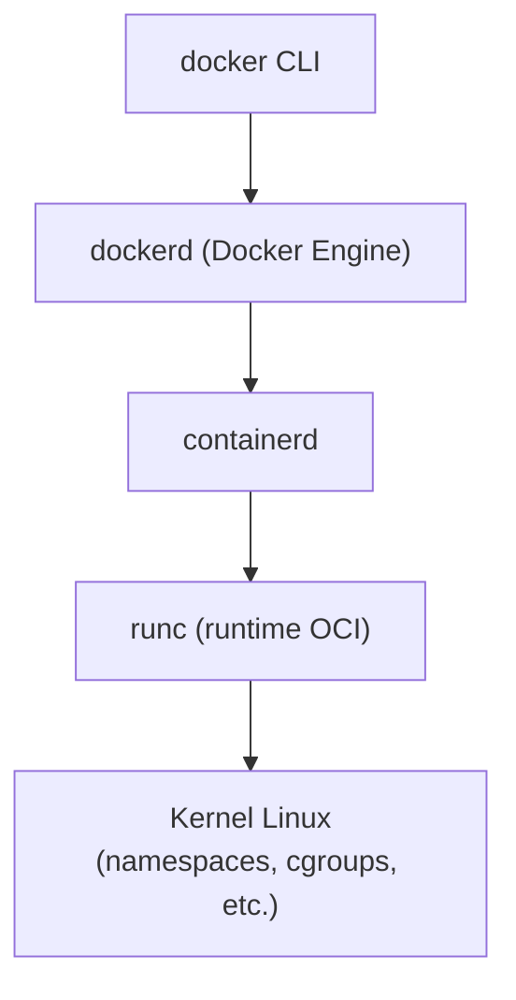
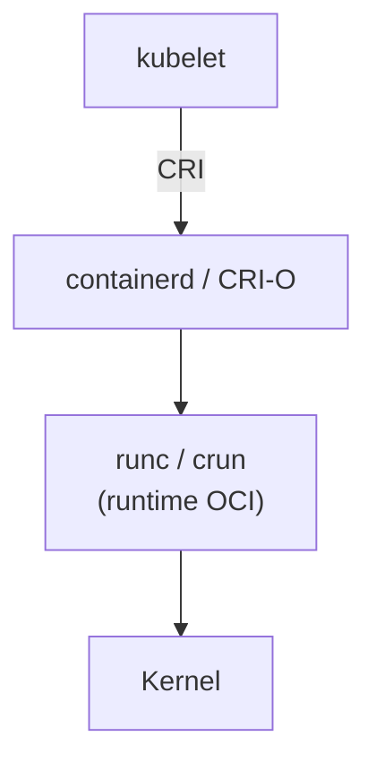

# Fundamentos prácticos de contenedores

Los contenedores son hoy la unidad básica de empaquetado y ejecución de aplicaciones en entornos de desarrollo y producción. Esta guía aborda los fundamentos prácticos que necesita un desarrollador para entender qué es realmente una imagen, cómo se relaciona con un contenedor, cómo encajan los runtimes OCI (containerd, runc, CRI-O) y cómo gestionar imágenes en el día a día. El foco está en proporcionar una base sólida sobre la cual construir flujos de build y ejecución reproducibles.

---

## Conceptos clave

**Imagen:** Plantilla inmutable que describe un sistema de archivos y metadatos (config, `entrypoint`, variables de entorno) a partir de la cual se pueden crear contenedores.

**Contenedor:** Instancia en ejecución (o detenida) de una imagen; combina sistema de archivos inmutable más una capa de escritura y aislamiento mediante namespaces/cgroups.

**Capa:** Diferencia incremental sobre una capa base; las imágenes suelen estar compuestas por varias capas apiladas y compartibles entre imágenes.

**OCI (Open Container Initiative):** Conjunto de especificaciones estándar para formatos de imagen y runtimes de contenedores, que permite interoperabilidad entre herramientas.

**Runtime OCI:** Componente de bajo nivel que habla con el kernel para crear, arrancar y detener contenedores (ejemplo: `runc`).

**Registro de contenedores:** Servicio donde se almacenan y distribuyen imágenes (por ejemplo, Docker Hub, registries privados).

---

## Imágenes, capas y contenedores

### Modelo conceptual

En desarrollo hay una idea **fundamental**:

* Una **imagen** es un *molde inmutable*.
* Un **contenedor** es una *instancia en ejecución* de ese molde, con sus propios cambios.

Es decir:

* La **imagen** describe *cómo* se ve el sistema de archivos (sistema operativo base, librerías, aplicación, etc.).
* El **contenedor** es un **proceso** que:
    * parte desde esa imagen, y
    * agrega una **capa de escritura** donde se almacenan los cambios.

Podemos modelar una imagen como un conjunto ordenado de capas de sólo lectura:

$$
I = (L_0, L_1, \dots, L_n)
$$

* $L_0$: capa base (por ejemplo `python:3.12-slim`).
* $L_1, L_2, \dots, L_n$: capas que se van agregando con cada instrucción relevante del `Dockerfile`.

Cuando se crea un contenedor, se agrega **encima** una capa de escritura $L_{\text{rw}}$:

$$
C = (L_0, L_1, \dots, L_n, L_{\text{rw}})
$$

* Todas las capas $L_0 \dots L_n$ son **sólo lectura**.
* La capa $L_{\text{rw}}$ es donde se escriben archivos creados o modificados por el contenedor.

En la práctica:

* La **imagen** se construye en tiempo de *build* (`docker build`, `podman build`, etc.).
* El **contenedor** se crea y se ejecuta en tiempo de *run* (`docker run`, `kubectl run`, etc.).

#### Ejemplo: imagen vs contenedor

Supongamos que usamos la imagen oficial `python:3.12-slim`:

```sh
# Listar imágenes locales
docker image ls

# Descargar imagen oficial de Python
docker pull python:3.12-slim

# Crear un contenedor interactivo desde la imagen
docker run --name py-demo --interactive --tty python:3.12-slim python
```

En este ejemplo:

* `python:3.12-slim` es la **imagen** (el molde).
* `py-demo` es el **contenedor** (la instancia en ejecución con su propia capa de escritura).

### Capas de imagen y caché de build

Las imágenes se construyen como una **pila de capas**, en general una por cada instrucción importante del `Dockerfile` que modifica el sistema de archivos.

Ejemplo de `Dockerfile`:

```dockerfile
FROM python:3.12-slim

# Crea una capa con dependencias del sistema
RUN apt-get update \
    && apt-get install -y curl \
    && rm -rf /var/lib/apt/lists/*

# Crea una capa con dependencias de Python
COPY requirements.txt /app/
RUN pip install --no-cache-dir -r /app/requirements.txt

# Crea una capa con el código de la aplicación
COPY src/ /app/src/

WORKDIR /app
CMD ["python", "-m", "src.main"]
```

Cada instrucción clave genera una capa:

* `FROM`: capa base $L_0$.
* `RUN apt-get ...`: nueva capa $L_1$.
* `COPY requirements.txt` y `RUN pip install ...`: nuevas capas (ej. $L_2$).
* `COPY src/`: nueva capa (ej. $L_3$).

Diagrama simplificado de capas:

| Operación          | Capa                                               |
| ------------------ | -------------------------------------------------- |
| Cambios en runtime | $L_{\text{rw}}$ (capa de escritura del contenedor) |
| `COPY src/`        | $L_3$                                              |
| `RUN pip install`  | $L_2$                                              |
| `RUN apt-get`      | $L_1$                                              |
| `python:3.12-slim` | $L_0$ (imagen base)                                |

#### ¿Por qué importan las capas? Caché de build

Cuando se reconstruye una imagen:

* Docker compara **instrucciones** y **archivos de entrada**.
* Si todo coincide con un build anterior, **reutiliza la capa** desde el caché.
* Si algo cambió, invalida esa capa y **todas las que están por encima**.

En el ejemplo:

* Si `requirements.txt` **no cambia**, la capa de `RUN pip install ...` puede **reutilizarse**.
* Si `requirements.txt` **cambia**, se invalida la capa de `pip install` (L2) y también las capas posteriores (por ejemplo L3).

!!! info "Orden de instrucciones y rendimiento"

    Para builds eficientes:

    * Sitúe **antes** las instrucciones que cambian poco:
        * Sistema base (`FROM`, `apt-get`).
        * Dependencias de Python (`requirements.txt` + `pip install`).
    * Sitúe **después** lo que cambia frecuentemente:
        * Código fuente (`COPY src/`).

    De este modo, al modificar únicamente el código:

    * Se reutilizan todas las capas previas desde caché.
    * El tiempo de build disminuye de forma considerable.

### `ENTRYPOINT` y `CMD` orientados a flujos de build y ejecución

Al definir una imagen, hay dos instrucciones clave:

* `ENTRYPOINT`: define **qué programa** se ejecuta por defecto en el contenedor.
* `CMD`: define **con qué argumentos** (o qué comando por defecto) se ejecuta ese programa.

Una forma útil de pensar en ello:

* `ENTRYPOINT`: “Este contenedor siempre ejecuta *este* programa”.
* `CMD`: “Si no se indica lo contrario, utiliza *estos parámetros*”.

Reglas prácticas:

* Utilice `ENTRYPOINT` para definir la **acción principal** del contenedor (por ejemplo, iniciar la aplicación).
* Utilice `CMD` para definir **valores por defecto** (modo `dev`, flags de depuración, etc.) que se puedan modificar al invocar `docker run`.

Ejemplo de `Dockerfile` orientado a desarrollo:

```dockerfile
FROM node:20-alpine

WORKDIR /app
COPY package*.json ./
RUN npm ci

COPY . .

# ENTRYPOINT: siempre ejecuta 'npm run'
ENTRYPOINT ["npm", "run"]

# CMD: script por defecto; se puede cambiar en docker run
CMD ["dev"]
```

Uso:

```bash
# Modo desarrollo por defecto (CMD = ["dev"])
docker run --rm -p 5173:5173 myapp:dev

# Modo build explícito (sobrescribe CMD)
docker run --rm myapp:dev build
```

En este contexto:

* `ENTRYPOINT ["npm", "run"]` es fijo:
    * El contenedor siempre ejecuta `npm run ...`.
* `CMD ["dev"]` es el valor por defecto:
    * Si no se pasan argumentos, se ejecuta `npm run dev`.
    * Si se pasa `build`, se ejecuta `npm run build`.

Esto se ajusta bien a flujos de desarrollo y CI/CD:

* Una misma imagen permite distintos modos (`dev`, `build`, `test`, etc.).
* No es necesario mantener múltiples imágenes para cada modo de ejecución.

!!! warning "Cuidado al combinar ENTRYPOINT y CMD"

    Errores frecuentes:

    * Definir `ENTRYPOINT` o `CMD` usando la **forma de shell**:
        * Ejemplo: `ENTRYPOINT npm run dev`.
        * Esto complica el manejo de señales y puede alterar el comportamiento esperado.
    * Extender una imagen y **sobrescribir `ENTRYPOINT` sin intención explícita**:
        * Al hacer `FROM otra-imagen` y luego definir un nuevo `ENTRYPOINT`, se puede perder el comportamiento original.

!!! info "Buenas prácticas recomendadas"

    * Prefiera siempre la **forma JSON**:
        * `ENTRYPOINT ["npm", "run"]`
        * `CMD ["dev"]`
    * Verifique la configuración final con:
        * `docker image inspect nombre-imagen` y revise los campos `Config.Entrypoint` y `Config.Cmd`.

---

## Runtimes OCI en entornos locales y clusters

### Estándares OCI: imágenes y runtimes

La Open Container Initiative (OCI) define principalmente dos especificaciones relevantes:

* **OCI Image Specification**: describe el formato estándar de las imágenes.
* **OCI Runtime Specification**: define cómo debe representarse y ejecutarse un contenedor (estructura del bundle, archivo de configuración JSON, etc.).

Gracias a estos estándares, distintas herramientas pueden:

* Construir imágenes (`docker build`, `buildah`, `kaniko`).
* Ejecutarlas con diferentes runtimes (`runc`, `crun`, `kata-containers`, entre otros).

En el día a día, el desarrollador normalmente **no invoca directamente** un runtime OCI; interactúa con capas superiores como Docker, Podman o Kubernetes.

### Docker Engine, containerd y runc

En muchas máquinas de desarrollo con Docker instalado, la arquitectura típica es:



* El CLI `docker` envía peticiones al daemon `dockerd`.
* `dockerd` delega en `containerd` la gestión de imágenes y contenedores.
* `containerd` utiliza `runc` para cumplir con la especificación OCI Runtime y crear procesos aislados.

Para ver qué runtimes tiene configurados Docker:

```bash
docker info | grep -i 'Runtimes' -A 2
```

!!! info "Docker Desktop en macOS/Windows"

    En macOS y Windows, Docker Desktop ejecuta una máquina virtual Linux ligera.  
    Todo el stack anterior se ejecuta dentro de esa VM; el usuario sólo interactúa con el CLI `docker` y la interfaz gráfica.

### CRI-O y runtimes en Kubernetes

Kubernetes no se comunica directamente con Docker Engine. Utiliza el **Container Runtime Interface (CRI)** para hablar con un runtime. Los más habituales son:

* **containerd** (en modo CRI): runtime de nivel intermedio que gestiona el ciclo de vida de imágenes y contenedores, delegando en un runtime OCI como `runc` o `crun`.
* **CRI-O**: implementación ligera del CRI que igualmente utiliza un runtime OCI (`runc`, `crun`) para arrancar contenedores.

Esquema simplificado en un nodo de Kubernetes:



Desde el punto de vista del desarrollador, es común encontrarse con:

```bash
# En un nodo Linux con acceso directo
ps aux | egrep 'containerd|crio'

# Desde kubectl: suele aparecer en la descripción del nodo
kubectl describe node <nombre-nodo> | grep -i 'Container Runtime'
```

!!! info "De Docker a containerd en Kubernetes"

    Las versiones modernas de Kubernetes dejaron de soportar el antiguo “dockershim”.
    En clusters recientes, lo normal es que el runtime subyacente sea `containerd` o `CRI-O`, no Docker Engine.

### Qué ve realmente el desarrollador

En el trabajo cotidiano:

* En **entornos locales de desarrollo**, es común usar:
    * Docker Engine (`docker`).
    * Podman (`podman`, sin daemon central).

* En **clusters Kubernetes**, el desarrollador interactúa principalmente a través de:
    * `kubectl`, Helm, ArgoCD, etc.
    * Manifiestos y pipelines que describen despliegues.
    * El runtime subyacente (containerd/CRI-O) queda normalmente abstraído.

Comprender que existe esa capa intermedia ayuda a:

* Diagnosticar errores que mencionan explícitamente al runtime (por ejemplo, mensajes de `runc`).
* Interpretar problemas de scheduling o ejecución de pods relacionados con el “container runtime”.

!!! warning "Evitar dependencia explícita de Docker en Kubernetes"

    En documentación y scripts de CI/CD conviene evitar asumir que el cluster usa “Docker”.  
    Lo correcto es hablar de **imágenes compatibles con OCI** y de contenedores que se ejecutarán sobre el runtime configurado (containerd, CRI-O, etc.).

---

## Comandos básicos de gestión de imágenes

Esta sección resume lo que se utiliza con mayor frecuencia para administrar imágenes en una máquina local.
Los ejemplos se muestran con `docker`, pero el comportamiento es muy similar en `podman`.

### Listar imágenes disponibles

Para ver qué imágenes están descargadas:

```bash
docker images
# o, forma moderna equivalente:
docker image ls
```

Salida típica:

```text
REPOSITORY      TAG       IMAGE ID       CREATED         SIZE
python          3.12      1d3f33b8c2f4   3 days ago      135MB
myapp-api       dev       5b23dd0a9d10   2 hours ago     210MB
nginx           1.27      7e4b9e5b7fe8   2 weeks ago     142MB
```

Significado de las columnas:

* **REPOSITORY**: nombre lógico de la imagen (`python`, `nginx`, `myapp-api`, etc.).
* **TAG**: variante o versión de la imagen (`3.12`, `dev`, `1.27`, etc.).
* **REPOSITORY:TAG** en conjunto identifican una imagen (por ejemplo `python:3.12`).
* **IMAGE ID**: identificador interno (hash) de la imagen.
* **SIZE**: tamaño aproximado de la imagen (considerando sus capas).

### Descargar imágenes oficiales

Para descargar una imagen desde un registro (por defecto, Docker Hub) se utiliza `docker pull <imagen>:<tag>`:

```bash
# Última versión etiquetada como 'latest' (no recomendado en producción)
docker pull nginx:latest

# Versión específica
docker pull nginx:1.27

# Imagen de Python oficial
docker pull python:3.12-slim
```

También es posible usar otros registros:

```bash
# Registro público distinto de Docker Hub (GitHub Container Registry)
docker pull ghcr.io/owner/repo:tag

# Registro privado con host propio
docker pull registry.ejemplo.com/miapp/backend:1.0.0
```

!!! warning "Evitar `latest` si se requiere reproducibilidad"

    `latest` es un **alias mutable**:

    * Hoy `nginx:latest` puede apuntar a `1.27`.
    * Mañana puede apuntar a `1.28`.

    Para builds reproducibles:

    * Prefiera tags versionados (`1.27`, `1.27.3`, etc.).
    * O, para máxima rigidez, utilice digests:
        * `nginx@sha256:<hash-largo>`.

### Eliminar imágenes

Para liberar espacio o eliminar imágenes que ya no se utilizan se emplea `docker rmi <id|nombre>`:

```bash
# Por nombre:tag
docker rmi nginx:1.27

# Por ID (basta con los primeros caracteres si no hay ambigüedad)
docker rmi 7e4b9e5b7fe8
```

Si la imagen está siendo utilizada por un contenedor:

```text
Error response from daemon: conflict: unable to delete 7e4b9e5b7fe8 (must be forced) - image is being used by running container ...
```

En dicho caso, el flujo habitual es:

1. Detener el contenedor:

    ```bash
    docker stop <nombre|id>
    ```

2. Eliminar el contenedor:

    ```bash
    docker rm <nombre|id>
    ```

3. Volver a intentar:

    ```bash
    docker rmi 7e4b9e5b7fe8
    ```

Eliminación forzada (usar con precaución):

```bash
docker rmi -f nginx:1.27
```

!!! warning "Eliminación forzada (`-f`)"

    `docker rmi -f`:

    * Puede borrar imágenes que todavía son necesarias para otros contenedores.
    * Puede afectar scripts o entornos que asumían la existencia de esa imagen.

    Úselo sólo cuando tenga claro qué imágenes se están eliminando y qué contenedores dependen de ellas.

### Limpiar imágenes sin uso

Con el tiempo se acumulan:

* Imágenes **dangling** (sin tag, restos de builds anteriores).
* Capas huérfanas.
* Imágenes que ya no tienen contenedores asociados.

Para limpiar únicamente las imágenes “dangling”:

```bash
docker image prune
```

El CLI muestra:

* Qué se va a borrar.
* Cuánto espacio se libera.
* Una confirmación previa a la eliminación.

Limpieza más agresiva (imágenes sin contenedores asociados):

```bash
docker image prune -a
```

Limpieza extendida de más recursos:

```bash
# Imágenes dangling, contenedores detenidos, redes no usadas, etc.
docker system prune

# Versión aún más agresiva (incluye imágenes sin uso)
docker system prune -a
```

!!! warning "`docker system prune -a`"

    Este comando:

    * Puede eliminar contenedores **detenidos pero relevantes**.
    * Puede borrar redes utilizadas para entornos de desarrollo o pruebas.

    Es muy útil para recuperar espacio, pero no debería ejecutarse sin revisar el impacto en una máquina compartida o con servicios importantes.

### Inspeccionar, etiquetar y entender capas

#### Inspeccionar una imagen

Para ver detalles internos de una imagen (incluyendo `ENTRYPOINT`, `CMD` y variables de entorno) se utiliza `docker image inspect`:

```bash
docker image inspect python:3.12-slim | jq '.[0].Config.Entrypoint, .[0].Config.Cmd'
```

Esto permite responder, por ejemplo:

* “¿Qué se ejecuta por defecto cuando uso `docker run python:3.12-slim`?”
* “¿Qué `ENTRYPOINT` y `CMD` quedaron finalmente configurados?”

Si no se dispone de `jq`, se puede inspeccionar el JSON completo:

```bash
docker image inspect python:3.12-slim
```

#### Ver historial de capas

Para entender **cómo** se construyó una imagen y relacionarla con el `Dockerfile`, se usa `docker history`:

```bash
docker history myapp:dev
```

Salida típica:

```text
IMAGE          CREATED         CREATED BY                                      SIZE      COMMENT
5b23dd0a9d10   2 hours ago     CMD ["python","-m","src.main"]                  0B
<missing>      2 hours ago     COPY src/ /app/src/                             12MB
<missing>      2 hours ago     RUN pip install --no-cache-dir -r ...           45MB
<missing>      3 days ago      /bin/sh -c apt-get update && apt-get install    65MB
1d3f33b8c2f4   3 days ago      /bin/sh -c #(nop)  CMD ["python3"]              0B
...
```

Lectura rápida:

* Cada fila representa una **capa**.
* La columna `CREATED BY` indica la instrucción que generó la capa (`RUN`, `COPY`, `CMD`, etc.).
* `SIZE` permite identificar:
    * Capas excesivamente grandes.
    * Posibles oportunidades de optimización (por ejemplo, combinar comandos o limpiar archivos temporales).

#### Etiquetar imágenes: `docker tag`

`docker tag` **no copia datos**, simplemente agrega un nuevo nombre (`REPOSITORY:TAG`) a un mismo `IMAGE ID`.

Ejemplo típico para preparar una imagen para enviarla a un registro:

```bash
# Agrega un nuevo tag a una imagen existente
docker tag myapp:dev registry.ejemplo.com/miapp/backend:1.0.0
```

Posteriormente se puede ejecutar:

```bash
docker push registry.ejemplo.com/miapp/backend:1.0.0
```

!!! info "Tags como punteros"

    * Un `IMAGE ID` es el “objeto” real.
    * Cada `REPOSITORY:TAG` es un **alias** o “puntero” a ese objeto.
    * Agregar o modificar un tag:
        * No reconstruye la imagen.
        * No aumenta el uso de disco de forma significativa.

    Esto permite, por ejemplo:

    * Tener `myapp:dev`, `myapp:staging` y `myapp:1.0.0` apuntando al mismo `IMAGE ID`.
    * Promocionar una misma imagen entre entornos (dev → staging → prod) únicamente actualizando tags.

---

## Instrucciones comunes de Dockerfile y su sintaxis

### `FROM` – Imagen base

Define **desde qué imagen** se construye la nueva imagen. Es **obligatoria** y suele ser la primera instrucción.

```dockerfile
# Sintaxis básica
FROM <imagen>[:<tag>]

# Con digest para máxima reproducibilidad
FROM <imagen>@sha256:<hash>

# Multi-stage build (nombrando una etapa)
FROM node:20-alpine AS build
FROM nginx:1.27-alpine AS runtime
```

Ejemplos:

```dockerfile
FROM python:3.12-slim
FROM ubuntu:24.04
```

!!! info "Multi-stage builds"

    Con `AS nombre` es posible nombrar una etapa y luego copiar artefactos desde ella mediante `COPY --from=nombre ...`.
    Esto permite reducir el tamaño de la imagen final (por ejemplo, compilando en una etapa y copiando sólo los binarios a otra).

### `ARG` – Variables de build

Define variables disponibles **sólo durante el build** (no permanecen como variables de entorno en la imagen final).

```dockerfile
# Definir argumento con valor por defecto
ARG APP_ENV=dev

# Usar el argumento en una instrucción
RUN echo "Building for $APP_ENV"
```

También se pueden utilizar en `FROM` (Docker 17.05+):

```dockerfile
ARG PY_VER=3.12-slim
FROM python:${PY_VER}
```

Uso en el build:

```bash
docker build --build-arg APP_ENV=prod -t myapp:prod .
```

### `RUN` – Ejecutar comandos en el build

Ejecuta comandos dentro de la imagen **durante el build**, generando una nueva capa. Es lo que se utiliza para instalar paquetes, compilar, generar artefactos, etc.

Formas principales:

```dockerfile
# Forma shell (más habitual)
RUN apt-get update && apt-get install -y curl

# Forma exec (más explícita)
RUN ["sh", "-c", "apt-get update && apt-get install -y curl"]
```

Ejemplo más completo:

```dockerfile
RUN apt-get update \
    && apt-get install -y --no-install-recommends curl \
    && rm -rf /var/lib/apt/lists/*
```

!!! info "Una capa por RUN"

    Cada instrucción `RUN` crea una **nueva capa**.

    A menudo conviene agrupar comandos relacionados en un único `RUN`:

    * Se reduce el número de capas.
    * Se disminuye el tamaño de la imagen (si se borran archivos temporales en el mismo `RUN`).

### `COPY` – Copiar archivos al contenedor

Copia archivos o directorios desde el contexto de build (**tu proyecto local**) al sistema de archivos de la imagen.

```dockerfile
# Sintaxis
COPY <origen>... <destino>

# Ejemplos
COPY requirements.txt /app/
COPY src/ /app/src/
COPY package*.json /app/
```

* `<origen>` es relativo al **contexto de build** (por ejemplo, la carpeta `.` usada en `docker build .`).
* `<destino>` es la ruta dentro de la imagen.

### `ADD` – Copiar con funcionalidades adicionales

Similar a `COPY`, pero con capacidades adicionales:

* Puede descomprimir archivos `.tar`.
* Puede usar URLs como origen.

```dockerfile
# Sintaxis
ADD <origen>... <destino>

# Ejemplo con tar
ADD app.tar.gz /app/
```

!!! warning "Prefiera `COPY` sobre `ADD`"

    En la mayoría de los casos, `COPY` es suficiente y más predecible.  

    Utilice `ADD` sólo cuando realmente necesite:

    * Descomprimir automáticamente un `.tar`, o
    * Descargar contenido desde una URL  
    
    y tenga claro el impacto en el caché de build y en la reproducibilidad.

### `WORKDIR` – Directorio de trabajo

Define el directorio de trabajo para las instrucciones siguientes (`RUN`, `CMD`, `ENTRYPOINT`, `COPY`, etc.).

```dockerfile
WORKDIR /app

COPY requirements.txt .
RUN pip install -r requirements.txt

COPY src/ .
```

Puede utilizarse varias veces, y las rutas posteriores pueden ser relativas:

```dockerfile
WORKDIR /app
WORKDIR src
# A partir de aquí, el directorio de trabajo es /app/src
```

### `ENV` – Variables de entorno

Define variables de entorno persistentes en la imagen (estarán disponibles en tiempo de ejecución dentro del contenedor).

Formas:

```dockerfile
# Forma clave-valor
ENV APP_ENV=prod

# Varios valores en una sola instrucción
ENV APP_ENV=prod APP_DEBUG=false

# Forma multilínea
ENV APP_ENV=prod \
    APP_DEBUG=false \
    API_URL=https://api.example.com
```

Estas variables pueden comprobarse, por ejemplo:

```bash
docker run --rm myapp:dev env | grep APP_
```

### `EXPOSE` – Puertos declarados

Documenta qué puertos **escucha** el contenedor. No publica el puerto por sí mismo; esto lo hace `-p` en `docker run` o la configuración del orquestador.

```dockerfile
EXPOSE 80
EXPOSE 5432/tcp
EXPOSE 8080/udp
```

En tiempo de ejecución:

```bash
# Publica el puerto 80 del contenedor en el 8080 del host
docker run -p 8080:80 myapp:web
```

!!! info "`EXPOSE` como metadato"

    `EXPOSE` funciona como **documentación** y como pista para herramientas como `docker run -P` o `docker-compose`.  
    Para exponer efectivamente el puerto hacia el host siempre se requiere `-p` (o configuración equivalente en Kubernetes, Docker Compose, etc.).

### `USER` – Usuario de ejecución

Cambia el usuario (y opcionalmente el grupo) con el que se ejecutarán las siguientes instrucciones y el proceso principal del contenedor.

```dockerfile
# Crear usuario y grupo
RUN groupadd -r app && useradd -r -g app app

# Cambiar usuario
USER app

# A partir de aquí, RUN, CMD y ENTRYPOINT se ejecutan como 'app'
```

También es posible usar IDs numéricos:

```dockerfile
USER 1000:1000
```

!!! warning "Evitar ejecutar como root en producción"

    Por motivos de seguridad, se recomienda que el proceso principal del contenedor **no** se ejecute como `root`.  
    Es preferible definir un usuario específico de aplicación y utilizar `USER`.

### `CMD` – Comando por defecto

Define el comando que se ejecuta por defecto cuando se invoca `docker run` sin parámetros adicionales.

Formas:

```dockerfile
# Forma exec (recomendada)
CMD ["python", "-m", "src.main"]

# Forma shell
CMD python -m src.main
```

* En la práctica sólo hay **un `CMD` efectivo**: el último definido en el Dockerfile.
* Si el usuario pasa un comando en `docker run`, este **reemplaza** al `CMD`.

Ejemplo:

```bash
docker run myapp:dev        # utiliza CMD
docker run myapp:dev bash   # reemplaza CMD por 'bash'
```

### `ENTRYPOINT` – Punto de entrada

Define el **programa principal** que se ejecuta siempre. `CMD` suele utilizarse entonces para definir los argumentos por defecto.

```dockerfile
# ENTRYPOINT: programa fijo
ENTRYPOINT ["npm", "run"]

# CMD: argumentos por defecto
CMD ["dev"]
```

En tiempo de ejecución:

```bash
docker run myapp:dev        # ejecuta: npm run dev
docker run myapp:dev build  # ejecuta: npm run build
```

!!! info "Relación ENTRYPOINT + CMD"

    Una forma útil de modelarlo es:

    * `ENTRYPOINT`: programa fijo.
    * `CMD`: lista de argumentos por defecto (modificables en `docker run`).

### `HEALTHCHECK` – Verificación de salud

Define cómo Docker puede comprobar si un contenedor está “sano”.

```dockerfile
HEALTHCHECK --interval=30s --timeout=5s --retries=3 \
    CMD curl -f http://localhost:8080/health || exit 1
```

Parámetros principales:

* `--interval`: frecuencia con que se ejecuta la comprobación.
* `--timeout`: tiempo máximo de espera de la respuesta.
* `--retries`: número de fallos consecutivos antes de marcar el contenedor como `unhealthy`.

### `LABEL` – Metadatos

Permite agregar metadatos en forma de pares clave–valor.

```dockerfile
LABEL maintainer="dev@ejemplo.com"
LABEL com.ejemplo.servicio="myapp-api" \
      com.ejemplo.version="1.0.0"
```

Útil para:

* Documentar quién mantiene la imagen.
* Asociar información de servicio, versión, o entorno.
* Definir criterios de filtrado en herramientas de CI/CD u orquestadores.

---

## Flujo práctico: de Dockerfile a contenedor en ejecución

En esta sección se integra todo lo anterior de forma práctica:

* Se define un proyecto mínimo.
* Se escribe un `Dockerfile`.
* Se construye una **imagen**.
* Se levanta un **contenedor** y se verifica su funcionamiento.

### Estructura mínima de un proyecto

Supongamos una API HTTP muy simple en Python.
Estructura de carpetas:

```text
mi-app/
├── src/
│   └── main.py
└── requirements.txt
```

#### Archivo `src/main.py`

```python
from http.server import HTTPServer, BaseHTTPRequestHandler

class SimpleHandler(BaseHTTPRequestHandler):
    def do_GET(self):
        self.send_response(200)
        self.send_header("Content-Type", "text/plain; charset=utf-8")
        self.end_headers()
        self.wfile.write(b"Hola desde un contenedor!\n")

if __name__ == "__main__":
    server = HTTPServer(("0.0.0.0", 8000), SimpleHandler)
    print("Servidor escuchando en http://0.0.0.0:8000")
    server.serve_forever()
```

Resumen del comportamiento:

* Levanta un servidor HTTP básico utilizando la librería estándar de Python.
* Escucha en `0.0.0.0:8000`:
    * `0.0.0.0`: todas las interfaces de red (necesario en contenedores).
    * `8000`: puerto de escucha.
* Ante una solicitud `GET`, responde con:
    * Código HTTP `200 OK`.
    * Texto plano: `"Hola desde un contenedor!"`.

#### Archivo `requirements.txt`

```text
# Deja vacío si no necesitas librerías externas
```

* Lista las dependencias de Python (por ejemplo `fastapi`, `requests`, etc.).
* En este ejemplo puede permanecer vacío, ya que se utiliza sólo la librería estándar.

### Dockerfile y explicación por capas

Se crea un archivo `Dockerfile` en la raíz del proyecto (`mi-app/Dockerfile`):

```dockerfile
FROM python:3.12-slim

# 1) Directorio de trabajo dentro de la imagen
WORKDIR /app

# 2) Copiar dependencias de Python (capa relativamente estable)
COPY requirements.txt /app/
RUN pip install --no-cache-dir -r requirements.txt || echo "Sin dependencias"

# 3) Copiar código de la aplicación (capa que cambia seguido)
COPY src/ /app/src/

# 4) Configurar red y comando por defecto
EXPOSE 8000
ENTRYPOINT ["python", "-m", "src.main"]
CMD []
```

Explicación línea por línea:

1. `FROM python:3.12-slim`

    * Indica a Docker que debe partir desde una imagen oficial de Python 3.12 en su variante “slim”.
    * Esta imagen ya incluye:
        * Un sistema base minimal.
        * Python instalado.

2. `WORKDIR /app`

   * Establece `/app` como directorio de trabajo dentro de la imagen.
   * Las rutas relativas utilizadas en instrucciones posteriores (`COPY`, `RUN`, etc.) se interpretan respecto de este directorio.

3. Bloque de dependencias:

    ```dockerfile
    COPY requirements.txt /app/
    RUN pip install --no-cache-dir -r requirements.txt || echo "Sin dependencias"
    ```

    * `COPY requirements.txt /app/`:
        * Copia el archivo `requirements.txt` desde el host a `/app` en la imagen.
    * `RUN pip install ...`:
        * Instala las dependencias definidas.
        * El sufijo `|| echo "Sin dependencias"` evita que el build falle en el caso de que no haya nada que instalar.

    Esta capa cambia sólo cuando se modifican las dependencias, por lo que es buena candidata para aprovechar el caché.

4. Bloque de código:

    ```dockerfile
    COPY src/ /app/src/
    ```

    * Copia el código de la aplicación (carpeta `src/`) al directorio `/app/src/` dentro de la imagen.
    * Esta capa suele cambiar con frecuencia (cada vez que se modifica el código fuente).

5. Configuración de red y comando por defecto:

    ```dockerfile
    EXPOSE 8000
    ENTRYPOINT ["python", "-m", "src.main"]
    CMD []
    ```

    * `EXPOSE 8000`:
        * Documenta que el contenedor escucha en el puerto 8000.
    * `ENTRYPOINT ["python", "-m", "src.main"]`:
        * Define que, al ejecutar un contenedor a partir de esta imagen, se lance `python -m src.main`.
    * `CMD []`:
        * No añade argumentos adicionales por defecto; en este ejemplo no se requieren.

#### Capas resultantes (conceptual)

1. `FROM python:3.12-slim` → **capa base** (runtime de Python).
2. `WORKDIR /app` → capa de configuración del directorio de trabajo.
3. `COPY requirements.txt` + `RUN pip install` → capa de **dependencias de Python**.
4. `COPY src/` → capa de **código**.
5. `EXPOSE`, `ENTRYPOINT`, `CMD` → capa de configuración final.

Si se modifica únicamente `src/main.py`:

* Docker puede reutilizar las capas 1–3 desde caché.
* Sólo reconstruye a partir de `COPY src/` en adelante, acelerando el build.

### Construir la imagen

Desde la raíz del proyecto (`mi-app/`):

```bash
# Construir imagen usando el Dockerfile de la carpeta actual
docker build -t mi-app:dev .
```

Desglose:

* `docker build`: construye una **imagen**.
* `-t mi-app:dev`: asigna nombre y tag:
    * `REPOSITORY = mi-app`
    * `TAG = dev`
    * Imagen resultante: `mi-app:dev`.
* `.`: define el **contexto de build** (la carpeta cuyos contenidos se envían al daemon de Docker).

Para comprobar que la imagen se creó correctamente:

```bash
docker image ls mi-app
```

Salida típica:

```text
REPOSITORY   TAG   IMAGE ID       CREATED          SIZE
mi-app       dev   9a7d3f4b1c2d   10 seconds ago   145MB
```

Para revisar el `ENTRYPOINT` y el `CMD` efectivos:

```bash
docker image inspect mi-app:dev | jq '.[0].Config.Entrypoint, .[0].Config.Cmd'
```

### Ejecutar un contenedor en local

Para levantar un contenedor a partir de la imagen:

```bash
docker run --rm -p 8000:8000 mi-app:dev
```

Componentes del comando:

* `docker run`:
    * Crea un **contenedor nuevo** desde la imagen indicada.
    * Inicia el proceso principal.
* `--rm`:
    * El contenedor se elimina automáticamente al detenerse (no queda registro residual).
* `-p 8000:8000`:
    * Mapea el puerto `8000` del host al puerto `8000` del contenedor (`host:contenedor`).
* `mi-app:dev`:
    * Nombre de la imagen a utilizar.

Si todo es correcto, aparecerá en la salida:

```text
Servidor escuchando en http://0.0.0.0:8000
```

En el navegador:

```text
http://localhost:8000
```

Debería mostrar:

```text
Hola desde un contenedor!
```

### Ver contenedores y logs

En otra terminal:

```bash
# Ver contenedores en ejecución
docker ps
```

Ejemplo de salida:

```text
CONTAINER ID   IMAGE        COMMAND                  STATUS         PORTS                    NAMES
abcd1234efgh   mi-app:dev   "python -m src.main"     Up 1 minute    0.0.0.0:8000->8000/tcp   elegant_morse
```

Para ver los logs:

```bash
docker logs <id-o-nombre>
# Por ejemplo:
docker logs abcd1234efgh
```

Cuando se presiona `Ctrl+C` en la terminal donde corre `docker run`:

* Docker envía una señal al proceso principal (`python -m src.main`) para que termine.
* El contenedor se detiene.
* Gracias a `--rm`:
    * Se borra la **capa de escritura** del contenedor.
    * Se elimina el contenedor como recurso de Docker.
* La imagen `mi-app:dev` permanece disponible para futuros contenedores.

### “Entrar” al contenedor y modificar cosas

Es posible acceder al entorno de un contenedor en ejecución:

```bash
docker exec -it <id-o-nombre> /bin/sh
# o, en imágenes que lo tengan disponible:
docker exec -it <id-o-nombre> bash
```

Dentro del contenedor se pueden:

* Explorar archivos.
* Instalar paquetes.
* Realizar pruebas rápidas, etc.

Sin embargo, es importante considerar:

* Todos los cambios se realizan en la **capa de escritura** del contenedor.
* Al eliminar el contenedor (o utilizar `--rm`), dichos cambios se pierden.
* Nada de eso se persiste en la imagen original.

!!! warning "No utilizar el contenedor como si fuera una máquina virtual permanente"

    Los contenedores son, por diseño, **efímeros**.  
    Cualquier modificación manual dentro de un contenedor en ejecución **no** se refleja en la imagen y **no** está garantizada al recrear el contenedor.

    Flujo recomendado:

    1. Probar los cambios de forma interactiva si es necesario.
    2. Tras validar lo que se desea, trasladar las modificaciones al `Dockerfile`.
    3. Reconstruir la imagen (`docker build ...`).
    4. Volver a levantar el contenedor a partir de la nueva imagen.

---

## Ejercicios

1. Explica con tus palabras la diferencia entre:

    1. Una **imagen** `nginx:1.27`.
    2. Un **contenedor** llamado `web-test` creado a partir de esa imagen.

    Indica al menos dos comandos diferentes para listar imágenes y contenedores, respectivamente.

    ??? "Ver solución"

        1. **Imagen `nginx:1.27`:**

            * Es una **plantilla inmutable** que contiene el sistema de archivos y configuración necesarios para ejecutar Nginx en una versión específica.
            * Reside en un registro (remoto) o localmente en el host como un conjunto de capas.

        2. **Contenedor `web-test`:**

            * Es una **instancia en ejecución (o detenida)** creada a partir de la imagen `nginx:1.27`.
            * Tiene su propia capa de escritura, configuración de red, PID, etc.

            En otras palabras, muchas instancias (contenedores) pueden compartir una misma imagen base.

            **Comandos para listar:**

            * Imágenes:

                ```bash
                docker images
                # o
                docker image ls
                ```

            * Contenedores:

                ```bash
                docker ps          # sólo en ejecución
                docker ps -a       # todos (en ejecución y detenidos)
                ```

2. Dado el siguiente `Dockerfile`:

    ```dockerfile
    FROM node:20-alpine

    WORKDIR /app
    COPY package.json package-lock.json ./
    RUN npm ci

    COPY . .

    ENTRYPOINT ["npm", "run"]
    CMD ["start"]
    ```

    Responde:

    1. ¿Qué capas serán reconstruidas si modificas sólo un archivo `.js` dentro del proyecto?
    2. ¿Qué comando se ejecuta exactamente al hacer `docker run mi-frontend:dev` sin argumentos?
    3. ¿Cómo invocarías el mismo contenedor pero ejecutando el script `build` en vez de `start`?

    ??? "Ver solución"

        1. **Capas reconstruidas al cambiar sólo un `.js`:**
        
            Dado el `Dockerfile`:
            
            ```dockerfile
            FROM node:20-alpine
            
            WORKDIR /app
            COPY package.json package-lock.json ./
            RUN npm ci
            
            COPY . .
            
            ENTRYPOINT ["npm", "run"]
            CMD ["start"]
            ```
            
            El cambio en un archivo `.js` afecta a la instrucción:
            
            ```dockerfile
            COPY . .
            ```
            
            Por lo tanto:
        
            * Las capas anteriores (`FROM`, `WORKDIR`, `COPY package*.json`, `RUN npm ci`) se mantienen en caché.
            * Sólo se reconstruye la capa correspondiente a `COPY . .` y la configuración final (`ENTRYPOINT`, `CMD`).

        2. **Comando ejecutado por defecto:**

            La combinación `ENTRYPOINT` + `CMD` funciona así:

            ```text
            ENTRYPOINT ["npm", "run"]
            CMD ["start"]
            ```

            Entonces, sin argumentos adicionales:

            ```bash
            docker run mi-frontend:dev
            ```

            ejecuta:

            ```bash
            npm run start
            ```

            dentro del contenedor.

        3. **Invocar el script `build`:**

            Para ejecutar el script `build` en vez de `start`, se sobrescribe         `CMD` al final:

            ```bash
            docker run mi-frontend:dev build
            ```
            
            Lo que se traduce en:
            
            ```bash
            npm run build
            ```
            
            dentro del contenedor (`ENTRYPOINT` se mantiene, `CMD` cambia).

3. Usando imágenes oficiales:

    1. Descarga la imagen `nginx:1.27`.
    2. Verifica que está disponible localmente.
    3. Arranca un contenedor llamado `nginx-lab` que exponga el puerto `8080` del host al `80` del contenedor.
    4. Detén y elimina el contenedor.
    5. Elimina la imagen `nginx:1.27` de tu máquina.

    Escribe los comandos que usarías en cada paso.

    ??? "Ver solución"

        1. **Descargar la imagen `nginx:1.27`:**

            ```bash
            docker pull nginx:1.27
            ```

        2. **Verificar que está disponible localmente:**

            ```bash
            docker image ls nginx
            # o más específico:
            docker image ls nginx:1.27
            ```

        3. **Arrancar un contenedor `nginx-lab` exponiendo 8080→80:**

            ```bash
            docker run --name nginx-lab -p 8080:80 -d nginx:1.27
            ```

            Aquí:

            * `--name nginx-lab` asigna un nombre al contenedor.
            * `-p 8080:80` mapea el puerto 8080 del host al 80 del contenedor.
            * `-d` lo ejecuta en segundo plano (detached).

        4. **Detener y eliminar el contenedor:**

            ```bash
            docker stop nginx-lab
            docker rm nginx-lab
            ```

        5. **Eliminar la imagen `nginx:1.27`:**

            ```bash
            docker rmi nginx:1.27
            ```

            Si hubiese contenedores aún asociados (aunque estén detenidos), tendrías que eliminarlos primero o usar `docker rmi -f`, con las precauciones del caso.

4. Supón que en tu máquina de desarrollo ejecutas:

    ```bash
    docker info | grep -i 'Runtimes' -A 2
    ```

    y obtienes algo como:

    ```text
    Runtimes: runc
    Default Runtime: runc
    ```

    En un cluster Kubernetes, al ejecutar:

    ```bash
    kubectl describe node nodo-1 | grep -i 'Container Runtime'
    ```

    ves:

    ```text
    Container Runtime Version: containerd://1.7.0
    ```

    1. Explica la relación entre `containerd` y `runc` en ambos entornos.
    2. ¿Por qué como desarrollador normalmente no necesitas llamar explícitamente a `runc`?

    ??? "Ver solución"

        1. **Relación entre `containerd` y `runc`:**

            * En tu máquina con Docker:

                ```bash
                docker info | grep -i 'Runtimes' -A 2
                ```

                muestra que el runtime por defecto es `runc`. Internamente, el flujo es:

                ```text
                docker CLI -> dockerd -> containerd -> runc -> kernel
                ```

                Es decir, `containerd` delega en `runc` para crear y gestionar los procesos de los contenedores.

            * En el cluster Kubernetes:

                ```bash
                kubectl describe node nodo-1 | grep -i 'Container Runtime Version'
                ```

                devuelve algo como `containerd://1.7.0`. Allí, el flujo típico es:

                ```text
                kubelet -> containerd (CRI) -> runc -> kernel
                ```

                De nuevo, `containerd` hace de “coordinador” y `runc` ejecuta la parte OCI de bajo nivel.

        2. **Por qué normalmente no necesitas llamar a `runc` directamente:**

            * Herramientas de más alto nivel (Docker, Podman, Kubernetes) ya encapsulan toda la lógica necesaria para:
                * Descargar imágenes.
                * Construirlas (en el caso de Docker/Podman).
                * Crear redes, volúmenes, etc.
                * Gestionar logs y estados.
            * Llamar a `runc` directamente implicaría trabajar con bundles OCI y configuraciones JSON de bajo nivel, lo que rara vez aporta valor al desarrollador de aplicaciones.
            * El runtime OCI se considera un detalle de implementación: se configura una vez en el host/cluster y luego se utiliza transparente a través de CLIs de más alto nivel.

## Referencias y lectura adicional

* https://docs.docker.com/get-started/docker-concepts/the-basics/what-is-an-image/
* https://www.docker.com/blog/docker-for-devops/
* https://docs.k0sproject.io/stable/runtime/
* https://kubernetes.io/es/docs/concepts/architecture/cri/
* https://kubernetes.io/docs/setup/production-environment/container-runtimes/
* https://specs.opencontainers.org/image-spec/
* https://specs.opencontainers.org/runtime-spec/
* https://docs.docker.com/reference/dockerfile/
