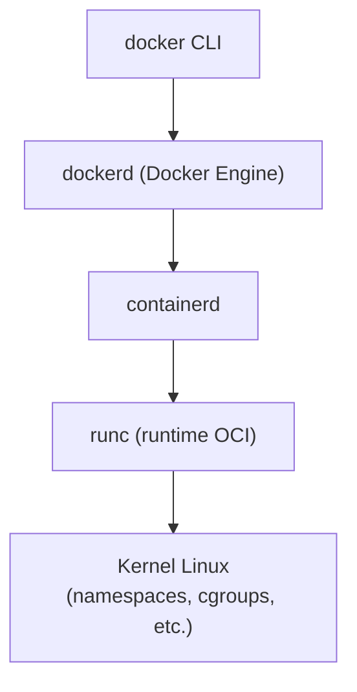
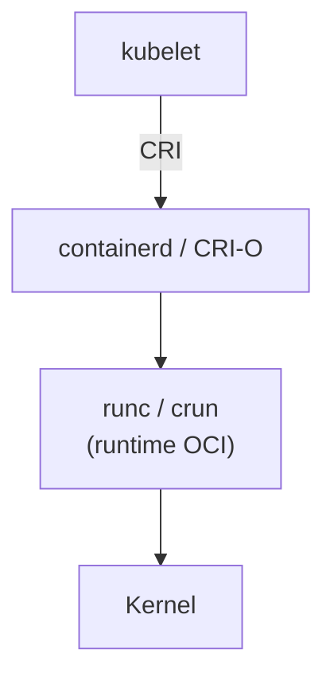

# Fundamentos prácticos de contenedores y runtimes OCI para desarrollo

Los contenedores son hoy la unidad básica de empaquetado y ejecución de aplicaciones en entornos de desarrollo y producción. Esta guía aborda los fundamentos prácticos que necesita un desarrollador para entender qué es realmente una imagen, cómo se relaciona con un contenedor, cómo encajan los runtimes OCI (containerd, runc, CRI-O) y cómo gestionar imágenes en el día a día. El foco está en proporcionar una base sólida sobre la cual construir flujos de build y ejecución reproducibles.

---

## Conceptos clave

**Imagen de contenedor:** Plantilla inmutable que describe un sistema de archivos y metadatos (config, `entrypoint`, variables de entorno) a partir de la cual se pueden crear contenedores.

**Contenedor:** Instancia en ejecución (o detenida) de una imagen; combina sistema de archivos inmutable más una capa de escritura y aislamiento mediante namespaces/cgroups.

**Capa (layer):** Diferencia incremental sobre una capa base; las imágenes suelen estar compuestas por varias capas apiladas y compartibles entre imágenes.

**OCI (Open Container Initiative):** Conjunto de especificaciones estándar para formatos de imagen y runtimes de contenedores, que permite interoperabilidad entre herramientas.

**Runtime OCI:** Componente de bajo nivel que habla con el kernel para crear, arrancar y detener contenedores (ejemplo: `runc`).

**containerd:** Runtime de nivel medio (daemon) que gestiona el ciclo de vida de imágenes y contenedores y delega en un runtime OCI como `runc`.

**CRI-O:** Implementación ligera del Container Runtime Interface (CRI) de Kubernetes que usa un runtime OCI (`runc`, `crun`) para arrancar contenedores.

**ENTRYPOINT:** Comando principal configurado en la imagen que define el proceso “principal” del contenedor.

**CMD:** Valores por defecto (parámetros o comando) que se pasan al `ENTRYPOINT` o definen el comando si no hay `ENTRYPOINT`.

**Registro de contenedores (registry):** Servicio donde se almacenan y distribuyen imágenes (por ejemplo, Docker Hub, registries privados).

---

## Imágenes, contenedores y capas en el flujo de desarrollo

### Modelo conceptual: de imagen a contenedor

En desarrollo es clave entender que una imagen **no es** un proceso, sino una **plantilla inmutable**. Cada vez que se arranca un contenedor se toma esa plantilla y se agrega una capa de escritura específica de la instancia.

Podemos modelar una imagen como un conjunto ordenado de capas:

$$
I = (L_0, L_1, \dots, L_n)
$$

donde cada ( L_i ) representa una capa de sólo lectura. El contenedor agrega una capa de escritura ( L_{\text{rw}} ):

$$
C = (L_0, L_1, \dots, L_n, L_{\text{rw}})
$$

En la práctica:

* La **imagen** se construye en tiempo de build (`docker build`, `podman build`, etc.).
* El **contenedor** se crea en tiempo de ejecución (`docker run`, `kubectl run`, etc.).

#### Ejemplo: imagen vs contenedor

Supongamos que tenemos una imagen `python:3.12-slim`:

```bash
# Listar imágenes locales
docker image ls

# Crear un contenedor interactivo desde la imagen
docker run --name py-demo -it python:3.12-slim python
```

En este ejemplo:

* `python:3.12-slim` es la **imagen**.
* `py-demo` es el **contenedor** (instancia de esa imagen con su propia capa de escritura).

!!! info "Regla mental útil"

    Una imagen es como una clase; el contenedor es como un objeto. Instancias distintas pueden compartir la “definición” (imagen) pero tener estado diferente.

### Capas de imagen y caché de build

Las imágenes se construyen como una pila de capas derivadas de las instrucciones del `Dockerfile` (u otro descriptor). Cada instrucción que modifica el sistema de archivos suele crear una nueva capa.

Ejemplo de `Dockerfile`:

```dockerfile
FROM python:3.12-slim

# Crea una capa con dependencias del sistema
RUN apt-get update && apt-get install -y curl && rm -rf /var/lib/apt/lists/*

# Crea una capa con dependencias de Python
COPY requirements.txt /app/
RUN pip install --no-cache-dir -r /app/requirements.txt

# Crea una capa con el código de la aplicación
COPY src/ /app/src/

WORKDIR /app
CMD ["python", "-m", "src.main"]
```

Diagrama ASCII simplificado de capas:

| Operación          | Capa                                    |
| ------------------ | --------------------------------------- |
| cambios en runtime | L_rw (capa de escritura del contenedor) |
| COPY src/          | L3                                      |
| pip install        | L2                                      |
| apt-get install    | L1                                      |
| python:3.12-slim   | L0 (imagen base)                        |

Cuando se reconstruye la imagen:

* Si `requirements.txt` **no cambia**, la capa de `pip install` se reutiliza del caché.
* Si `requirements.txt` cambia, se invalida L2 y todas las capas posteriores.

!!! info "Orden de instrucciones y performance"

    Instrucciones que cambian poco (como dependencias del sistema o de Python) conviene ponerlas **antes** que las que cambian mucho (como el código fuente) para maximizar el uso de caché.

### `ENTRYPOINT` y `CMD` orientados a flujos de build y ejecución

En la configuración de una imagen se definen dos conceptos clave:

* `ENTRYPOINT`: comando **principal** del contenedor.
* `CMD`: valores por defecto (argumentos o comando) que se pasan al `ENTRYPOINT`.

Reglas prácticas:

* Usa `ENTRYPOINT` para definir “qué hace” el contenedor por defecto (por ejemplo, arrancar la app).
* Usa `CMD` para definir parámetros por defecto (por ejemplo, puerto, opciones de debug) que pueden sobrescribirse en tiempo de ejecución.

Ejemplo de `Dockerfile` orientado a desarrollo:

```dockerfile
FROM node:20-alpine

WORKDIR /app
COPY package*.json ./
RUN npm ci

COPY . .

# ENTRYPOINT: siempre ejecuta Node en modo app
ENTRYPOINT ["npm", "run"]

# CMD: script por defecto, se puede cambiar en docker run
CMD ["dev"]
```

Uso:

```bash
# Modo desarrollo por defecto (CMD = dev)
docker run --rm -p 5173:5173 myapp:dev

# Modo build explícito (sobreescribe CMD)
docker run --rm myapp:dev build
```

Aquí:

* `ENTRYPOINT ["npm", "run"]` se mantiene constante.
* `CMD ["dev"]` se cambia a `build` en tiempo de ejecución para integrarlo en flujos de CI/CD.

!!! warning "Cuidado al mezclar ENTRYPOINT y CMD"

    Si defines ambos como cadenas (shell form) o redefines `ENTRYPOINT` al extender una imagen, puedes perder el comportamiento esperado. Prefiere la forma JSON (`["cmd", "arg"]`) y revisa siempre el resultado con `docker image inspect`.

---

## Runtimes OCI en entornos locales y clusters

### Estándares OCI: imágenes y runtimes

La Open Container Initiative define principalmente dos especificaciones:

* **OCI Image Specification:** describe el formato estándar de las imágenes.
* **OCI Runtime Specification:** describe cómo debe representarse y ejecutarse un contenedor (config JSON, bundle, etc.).

Gracias a esto, múltiples herramientas pueden:

* Construir imágenes (`docker build`, `buildah`, `kaniko`).
* Ejecutarlas con distintos runtimes (`runc`, `crun`, `kata-containers`).

El desarrollador, en general, **no invoca directamente** a un runtime OCI; interactúa con capas superiores (Docker, Podman, Kubernetes).

### Docker Engine, containerd y runc

En muchas máquinas de desarrollo con Docker instalado, el stack típico es:



* `docker` (CLI) envía peticiones a `dockerd`.
* `dockerd` delega en `containerd` la gestión de imágenes y contenedores.
* `containerd` usa `runc` para cumplir la especificación OCI Runtime y crear procesos aislados.

Puedes ver el runtime activo, por ejemplo:

```bash
docker info | grep -i 'Runtimes' -A 2
```

!!! info "Docker Desktop en macOS/Windows"

    En macOS/Windows, Docker Desktop ejecuta una VM Linux liviana. Todo el stack anterior vive dentro de esa VM; el usuario sólo ve el CLI `docker` y la interfaz gráfica.

### CRI-O y runtimes en Kubernetes

Kubernetes no sabe hablar directamente con Docker Engine. Usa el **Container Runtime Interface (CRI)** para comunicarse con un runtime. Los dos más comunes son:

* **containerd** (modo CRI).
* **CRI-O**.

Ambos, a su vez, usan un runtime OCI (`runc`, `crun`) para arrancar contenedores.

Esquema simplificado en un nodo de Kubernetes:



Como desarrollador, típicamente verás:

```bash
# En un nodo Linux con acceso
ps aux | egrep 'containerd|crio'

# Desde kubectl: el runtime suele aparecer en la descripción del nodo
kubectl describe node <nombre-nodo> | grep -i 'Container Runtime'
```

!!! info "De Docker a containerd en Kubernetes"

    Versiones modernas de Kubernetes dejaron de soportar el “dockershim” integrado. Hoy, en clusters recientes, lo normal es encontrar `containerd` o `CRI-O`, no Docker Engine, como runtime de contenedores.

### Qué ve realmente el desarrollador

En el día a día:

* En **desarrollo local**, es común usar:
  * Docker Engine (CLI `docker`).
  * Podman (CLI `podman`, sin daemon).

* En **clusters**, el desarrollador interactúa vía:
  * `kubectl`, Helm, ArgoCD, etc.
  * El runtime subyacente (containerd/CRI-O) se mantiene transparente en la mayoría de los casos.

Sin embargo, entender que existe esa capa ayuda a:

* Diagnosticar problemas de runtime (por ejemplo, errores de `runc` en logs).
* Interpretar mensajes de error de Kubernetes relacionados con “container runtime”.

!!! warning "No depender de Docker específico en Kubernetes"

    En documentación y scripts de CI/CD evita asumir explícitamente “Docker”. Lo correcto es hablar de **imágenes OCI** y contenedores que se ejecutarán en el runtime que el cluster tenga configurado (containerd, CRI-O, etc.).

---

## Comandos básicos de gestión de imágenes

Esta sección cubre lo que un desarrollador usa todos los días para manejar imágenes en su máquina local. Se muestran ejemplos con `docker`, pero la semántica es muy similar en `podman`.

### Listar imágenes disponibles

Para ver qué imágenes tienes descargadas:

```bash
docker images
# o, forma moderna equivalente:
docker image ls
```

Salida típica:

```text
REPOSITORY      TAG       IMAGE ID       CREATED         SIZE
python          3.12      1d3f33b8c2f4   3 days ago      135MB
myapp-api       dev       5b23dd0a9d10   2 hours ago     210MB
nginx           1.27      7e4b9e5b7fe8   2 weeks ago     142MB
```

Claves:

* `REPOSITORY:TAG` identifica una imagen.
* `IMAGE ID` es el identificador interno (hash).
* `SIZE` es el tamaño aproximado total (incluyendo capas compartidas).

### Descargar imágenes oficiales: `docker pull <imagen>:<tag>`

Para descargar una imagen desde un registro (por defecto, Docker Hub):

```bash
# Última versión etiquetada como 'latest' (no recomendado en producción)
docker pull nginx:latest

# Versión específica
docker pull nginx:1.27

# Imagen de Python oficial
docker pull python:3.12-slim
```

También puedes usar un registro explícito:

```bash
# Registro público distinto de Docker Hub
docker pull ghcr.io/owner/repo:tag

# Registro privado con host
docker pull registry.ejemplo.com/miapp/backend:1.0.0
```

!!! warning "Evita `latest` en flujos reproducibles"

    El tag `latest` es mutable; si necesitas reproducibilidad, usa tags específicos (idealmente versionados) o digests (`@sha256:...`).

### Eliminar imágenes: `docker rmi <id|nombre>`

Para liberar espacio o limpiar imágenes que ya no usas:

```bash
# Por nombre:tag
docker rmi nginx:1.27

# Por ID (primeros caracteres suelen bastar)
docker rmi 7e4b9e5b7fe8
```

Si la imagen está siendo usada por un contenedor:

```bash
Error response from daemon: conflict: unable to delete 7e4b9e5b7fe8 (must be forced) - image is being used by running container ...
```

En ese caso:

1. Detén el contenedor: `docker stop <nombre|id>`.
2. Elimínalo: `docker rm <nombre|id>`.
3. Vuelve a ejecutar `docker rmi`.

Eliminación forzada (útil pero con cuidado):

```bash
docker rmi -f nginx:1.27
```

!!! warning "Forzar la eliminación"

    Usar `-f` puede romper scripts o entornos si otros contenedores dependen de la misma imagen. Úsalo sólo cuando sepas exactamente qué estás borrando.

### Limpiar imágenes sin uso: `docker image prune`

Con el tiempo se acumulan:

* Imágenes “dangling” (sin tag).
* Capas huérfanas.
* Imágenes que ya no tienen contenedores asociados.

Para limpiarlas:

```bash
# Eliminar sólo imágenes dangling (sin tag)
docker image prune
```

El CLI mostrará un resumen de lo que va a borrar y pedirá confirmación.

Limpieza más agresiva (imágenes sin contenedores):

```bash
docker image prune -a
```

Limpieza extendida (imágenes, contenedores detenidos, redes no usadas, etc.):

```bash
docker system prune
# o
docker system prune -a   # aún más agresivo
```

!!! warning "`docker system prune -a`"

    Este comando puede borrar más de lo que deseas (incluyendo contenedores detenidos útiles y redes). Es potente para recuperar espacio, pero no deberías usarlo a ciegas en entornos compartidos.

### Inspeccionar, etiquetar y entender capas

#### Inspeccionar imagen: `docker image inspect`

Para ver metadatos, incluidos `ENTRYPOINT` y `CMD`:

```bash
docker image inspect python:3.12-slim | jq '.[0].Config.Entrypoint, .[0].Config.Cmd'
```

Esto ayuda a verificar qué comando se ejecutará al hacer `docker run`.

#### Ver historial de capas: `docker history`

Para entender cómo se compuso una imagen:

```bash
docker history myapp:dev
```

Salida típica:

```text
IMAGE          CREATED         CREATED BY                                      SIZE      COMMENT
5b23dd0a9d10   2 hours ago     CMD ["python","-m","src.main"]                 0B
<missing>      2 hours ago     COPY src/ /app/src/                            12MB
<missing>      2 hours ago     RUN pip install --no-cache-dir -r ...          45MB
<missing>      3 days ago      /bin/sh -c apt-get update && apt-get install   65MB
1d3f33b8c2f4   3 days ago      /bin/sh -c #(nop)  CMD ["python3"]            0B
...
```

#### Etiquetar imágenes: `docker tag`

Para renombrar o preparar un nombre para push:

```bash
# Renombra localmente (no copia datos, sólo agrega una referencia)
docker tag myapp:dev registry.ejemplo.com/miapp/backend:1.0.0
```

Luego podrás hacer `docker push registry.ejemplo.com/miapp/backend:1.0.0`.

!!! info "Tags como punteros"

    Piensa los tags como punteros a un `IMAGE ID`. Cambiar o agregar un tag no reconstruye la imagen, sólo agrega o mueve un alias.

---

## Flujo práctico: de Dockerfile a contenedor en ejecución

En esta sección se integra todo: imagen vs contenedor, capas, `ENTRYPOINT/CMD` y gestión básica de imágenes en un flujo reproducible.

### Estructura mínima de un proyecto

Supongamos una API HTTP muy simple en Python:

```text
mi-app/
├── src/
│   └── main.py
└── requirements.txt
```

`src/main.py`:

```python
from http.server import HTTPServer, BaseHTTPRequestHandler

class SimpleHandler(BaseHTTPRequestHandler):
    def do_GET(self):
        self.send_response(200)
        self.send_header("Content-Type", "text/plain; charset=utf-8")
        self.end_headers()
        self.wfile.write(b"Hola desde un contenedor!\n")

if __name__ == "__main__":
    server = HTTPServer(("0.0.0.0", 8000), SimpleHandler)
    print("Servidor escuchando en http://0.0.0.0:8000")
    server.serve_forever()
```

`requirements.txt` (vacío o con dependencias mínimas):

```text
# Deja vacío si no necesitas librerías externas
```

### Dockerfile y análisis por capas

`Dockerfile`:

```dockerfile
FROM python:3.12-slim

#) Directorio de trabajo
WORKDIR /app

#) Copiar dependencias de Python (capa estable)
COPY requirements.txt /app/
RUN pip install --no-cache-dir -r requirements.txt || echo "Sin dependencias"

#) Copiar código de la aplicación (capa volátil)
COPY src/ /app/src/

#) Configurar ENTRYPOINT/CMD
EXPOSE 8000
ENTRYPOINT ["python", "-m", "src.main"]
CMD []
```

Capas generadas (conceptualmente):

1. `FROM python:3.12-slim` → capa base (runtime de Python).
2. `WORKDIR /app` → pequeña capa de metadatos.
3. `COPY requirements.txt` + `RUN pip install` → capa de dependencias Python.
4. `COPY src/` → capa de código.
5. `EXPOSE` y `ENTRYPOINT/CMD` → config.

Si cambias sólo `src/main.py`, se invalidará **sólo** la capa de código; las dependencias se mantienen en caché.

!!! info "Optimizar el orden"

    Al copiar primero `requirements.txt` y luego el código, evitas reinstalar dependencias cada vez que tocas un archivo fuente.

### Construir la imagen

Desde la raíz del proyecto:

```bash
# Construir imagen con tag explícito
docker build -t mi-app:dev .

# Verificar que la imagen existe
docker image ls mi-app
```

Salida esperada:

```text
REPOSITORY   TAG   IMAGE ID       CREATED          SIZE
mi-app       dev   9a7d3f4b1c2d   10 seconds ago   145MB
```

Puedes inspeccionar el `ENTRYPOINT` resultante:

```bash
docker image inspect mi-app:dev | jq '.[0].Config.Entrypoint, .[0].Config.Cmd'
```

### Ejecutar un contenedor en local

Ahora arranca un contenedor:

```bash
docker run --rm -p 8000:8000 mi-app:dev
```

Aquí:

* `--rm` elimina el contenedor cuando se detenga.
* `-p 8000:8000` publica el puerto 8000 del contenedor en el 8000 de tu host.
* `mi-app:dev` especifica la imagen.

Abre en el navegador:

```text
http://localhost:8000
```

Debes ver:

```text
Hola desde un contenedor!
```

Para ver logs en otro terminal:

```bash
# Listar contenedores en ejecución
docker ps

# Ver logs del contenedor
docker logs <id-o-nombre>
```

Cuando detienes el contenedor (Ctrl+C en el terminal donde corre):

* El runtime OCI (`runc`) termina el proceso principal.
* Docker limpia la capa de escritura (gracias a `--rm`).
* La imagen `mi-app:dev` permanece disponible para futuros contenedores.

!!! warning "Evitar usar contenedores como máquinas virtuales"

    Aunque puedes entrar con `docker exec -it <contenedor> /bin/sh` y “tocar cosas”, recuerda que cualquier cambio manual se pierde al destruir el contenedor y no queda reflejado en la imagen. Para cambios persistentes, modifica el `Dockerfile` y reconstruye.

---

## Ejercicios

1. Explica con tus palabras la diferencia entre:

    1. Una **imagen** `nginx:1.27`.
    2. Un **contenedor** llamado `web-test` creado a partir de esa imagen.

    Indica al menos dos comandos diferentes para listar imágenes y contenedores, respectivamente.

    ??? "Ver solución"

        1. **Imagen `nginx:1.27`:**

            * Es una **plantilla inmutable** que contiene el sistema de archivos y configuración necesarios para ejecutar Nginx en una versión específica.
            * Reside en un registro (remoto) o localmente en el host como un conjunto de capas.

        2. **Contenedor `web-test`:**

            * Es una **instancia en ejecución (o detenida)** creada a partir de la imagen `nginx:1.27`.
            * Tiene su propia capa de escritura, configuración de red, PID, etc.

            En otras palabras, muchas instancias (contenedores) pueden compartir una misma imagen base.

            **Comandos para listar:**

            * Imágenes:

                ```bash
                docker images
                # o
                docker image ls
                ```

            * Contenedores:

                ```bash
                docker ps          # sólo en ejecución
                docker ps -a       # todos (en ejecución y detenidos)
                ```

2. Dado el siguiente `Dockerfile`:

    ```dockerfile
    FROM node:20-alpine

    WORKDIR /app
    COPY package.json package-lock.json ./
    RUN npm ci

    COPY . .

    ENTRYPOINT ["npm", "run"]
    CMD ["start"]
    ```

    Responde:

    1. ¿Qué capas serán reconstruidas si modificas sólo un archivo `.js` dentro del proyecto?
    2. ¿Qué comando se ejecuta exactamente al hacer `docker run mi-frontend:dev` sin argumentos?
    3. ¿Cómo invocarías el mismo contenedor pero ejecutando el script `build` en vez de `start`?

    ??? "Ver solución"

        1. **Capas reconstruidas al cambiar sólo un `.js`:**
        
            Dado el `Dockerfile`:
            
            ```dockerfile
            FROM node:20-alpine
            
            WORKDIR /app
            COPY package.json package-lock.json ./
            RUN npm ci
            
            COPY . .
            
            ENTRYPOINT ["npm", "run"]
            CMD ["start"]
            ```
            
            El cambio en un archivo `.js` afecta a la instrucción:
            
            ```dockerfile
            COPY . .
            ```
            
            Por lo tanto:
        
            * Las capas anteriores (`FROM`, `WORKDIR`, `COPY package*.json`,         `RUN npm ci`) se mantienen en caché.
            * Sólo se reconstruye la capa correspondiente a `COPY . .` y la         configuración final (`ENTRYPOINT`, `CMD`).

        2. **Comando ejecutado por defecto:**

            La combinación `ENTRYPOINT` + `CMD` funciona así:

            ```text
            ENTRYPOINT ["npm", "run"]
            CMD ["start"]
            ```

            Entonces, sin argumentos adicionales:

            ```bash
            docker run mi-frontend:dev
            ```

            ejecuta:

            ```bash
            npm run start
            ```

            dentro del contenedor.

        3. **Invocar el script `build`:**

            Para ejecutar el script `build` en vez de `start`, se sobrescribe         `CMD` al final:

            ```bash
            docker run mi-frontend:dev build
            ```
            
            Lo que se traduce en:
            
            ```bash
            npm run build
            ```
            
            dentro del contenedor (`ENTRYPOINT` se mantiene, `CMD` cambia).

3. Usando imágenes oficiales:

    1. Descarga la imagen `nginx:1.27`.
    2. Verifica que está disponible localmente.
    3. Arranca un contenedor llamado `nginx-lab` que exponga el puerto `8080` del host al `80` del contenedor.
    4. Detén y elimina el contenedor.
    5. Elimina la imagen `nginx:1.27` de tu máquina.

    Escribe los comandos que usarías en cada paso.

    ??? "Ver solución"

        1. **Descargar la imagen `nginx:1.27`:**

            ```bash
            docker pull nginx:1.27
            ```

        2. **Verificar que está disponible localmente:**

            ```bash
            docker image ls nginx
            # o más específico:
            docker image ls nginx:1.27
            ```

        3. **Arrancar un contenedor `nginx-lab` exponiendo 8080→80:**

            ```bash
            docker run --name nginx-lab -p 8080:80 -d nginx:1.27
            ```

            Aquí:

            * `--name nginx-lab` asigna un nombre al contenedor.
            * `-p 8080:80` mapea el puerto 8080 del host al 80 del contenedor.
            * `-d` lo ejecuta en segundo plano (detached).

        4. **Detener y eliminar el contenedor:**

            ```bash
            docker stop nginx-lab
            docker rm nginx-lab
            ```

        5. **Eliminar la imagen `nginx:1.27`:**

            ```bash
            docker rmi nginx:1.27
            ```

            Si hubiese contenedores aún asociados (aunque estén detenidos), tendrías que eliminarlos primero o usar `docker rmi -f`, con las precauciones del caso.

4. Supón que en tu máquina de desarrollo ejecutas:

    ```bash
    docker info | grep -i 'Runtimes' -A 2
    ```

    y obtienes algo como:

    ```text
    Runtimes: runc
    Default Runtime: runc
    ```

    En un cluster Kubernetes, al ejecutar:

    ```bash
    kubectl describe node nodo-1 | grep -i 'Container Runtime'
    ```

    ves:

    ```text
    Container Runtime Version: containerd://1.7.0
    ```

    1. Explica la relación entre `containerd` y `runc` en ambos entornos.
    2. ¿Por qué como desarrollador normalmente no necesitas llamar explícitamente a `runc`?

    ??? "Ver solución"

        1. **Relación entre `containerd` y `runc`:**

            * En tu máquina con Docker:

                ```bash
                docker info | grep -i 'Runtimes' -A 2
                ```

                muestra que el runtime por defecto es `runc`. Internamente, el flujo es:

                ```text
                docker CLI -> dockerd -> containerd -> runc -> kernel
                ```

                Es decir, `containerd` delega en `runc` para crear y gestionar los procesos de los contenedores.

            * En el cluster Kubernetes:

                ```bash
                kubectl describe node nodo-1 | grep -i 'Container Runtime Version'
                ```

                devuelve algo como `containerd://1.7.0`. Allí, el flujo típico es:

                ```text
                kubelet -> containerd (CRI) -> runc -> kernel
                ```

                De nuevo, `containerd` hace de “coordinador” y `runc` ejecuta la parte OCI de bajo nivel.

        2. **Por qué normalmente no necesitas llamar a `runc` directamente:**

            * Herramientas de más alto nivel (Docker, Podman, Kubernetes) ya encapsulan toda la lógica necesaria para:
                * Descargar imágenes.
                * Construirlas (en el caso de Docker/Podman).
                * Crear redes, volúmenes, etc.
                * Gestionar logs y estados.
            * Llamar a `runc` directamente implicaría trabajar con bundles OCI y configuraciones JSON de bajo nivel, lo que rara vez aporta valor al desarrollador de aplicaciones.
            * El runtime OCI se considera un detalle de implementación: se configura una vez en el host/cluster y luego se utiliza transparente a través de CLIs de más alto nivel.

---

## Referencias y lectura adicional

* Kubernetes Authors, *Container Runtimes*, Documentación oficial de Kubernetes (sección de configuración de runtimes CRI).
* Docker Inc., *Docker Engine Overview* y *Dockerfile reference*, Documentación oficial de Docker.
* Open Container Initiative (OCI), *Runtime Specification* y *Image Specification*, especificaciones oficiales disponibles en el sitio de la OCI.
