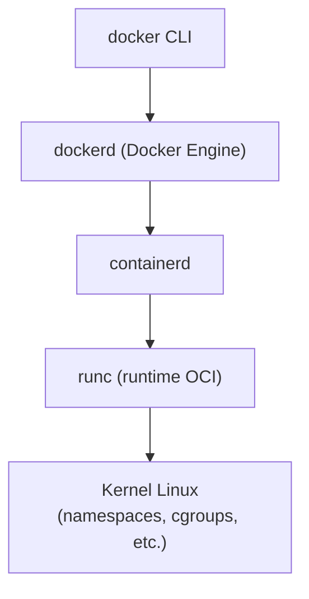
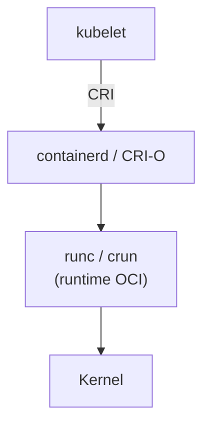

# Fundamentos prácticos de contenedores

Los contenedores son hoy la unidad básica de empaquetado y ejecución de aplicaciones en entornos de desarrollo y producción. Esta guía aborda los fundamentos prácticos que necesita un desarrollador para entender qué es realmente una imagen, cómo se relaciona con un contenedor, cómo encajan los runtimes OCI (containerd, runc, CRI-O) y cómo gestionar imágenes en el día a día. El foco está en proporcionar una base sólida sobre la cual construir flujos de build y ejecución reproducibles.

---

## Conceptos clave

**Imagen:** Plantilla inmutable que describe un sistema de archivos y metadatos (config, `entrypoint`, variables de entorno) a partir de la cual se pueden crear contenedores.

**Contenedor:** Instancia en ejecución (o detenida) de una imagen; combina sistema de archivos inmutable más una capa de escritura y aislamiento mediante namespaces/cgroups.

**Capa:** Diferencia incremental sobre una capa base; las imágenes suelen estar compuestas por varias capas apiladas y compartibles entre imágenes.

**OCI (Open Container Initiative):** Conjunto de especificaciones estándar para formatos de imagen y runtimes de contenedores, que permite interoperabilidad entre herramientas.

**Runtime OCI:** Componente de bajo nivel que habla con el kernel para crear, arrancar y detener contenedores (ejemplo: `runc`).

**Registro de contenedores:** Servicio donde se almacenan y distribuyen imágenes (por ejemplo, Docker Hub, registries privados).

---

## Imágenes, capas y contenedores

### Modelo conceptual

En desarrollo hay una idea **fundamental**:

* Una **imagen** es un *molde inmutable*.
* Un **contenedor** es una *instancia en ejecución* de ese molde, con sus propios cambios.

Es decir:

* La **imagen** describe *cómo* se ve el sistema de archivos (SO base, librerías, app, etc.).
* El **contenedor** es un **proceso** que:
    * parte desde esa imagen
    * y encima le agrega una **capa de escritura** donde se guardan los cambios.

Podemos modelar una imagen como un conjunto ordenado de capas de sólo lectura:

$$
I = (L_0, L_1, \dots, L_n)
$$

* $L_0$: capa base (por ejemplo `python:3.12-slim`)
* $L_1, L_2, \dots, L_n$: capas que se van agregando con cada instrucción del `Dockerfile`.

Cuando creas un contenedor, se agrega **encima** una capa de escritura $L_{\text{rw}}$:

$$
C = (L_0, L_1, \dots, L_n, L_{\text{rw}})
$$

* Todas las capas $L_0 \dots L_n$ son **sólo lectura**.
* La capa $L_{\text{rw}}$ es donde se escriben archivos creados o modificados por el contenedor.

En la práctica:

* La **imagen** se construye en tiempo de *build* (`docker build`, `podman build`, etc.).
* El **contenedor** se crea y se ejecuta en tiempo de *run* (`docker run`, `kubectl run`, etc.).

#### Ejemplo: imagen vs contenedor

Supongamos que usamos la imagen oficial `python:3.12-slim`:

```sh
# Listar imágenes locales
docker image ls

# Descargar imagen oficial de Python
docker pull python:3.12-slim

# Crear un contenedor interactivo desde la imagen
docker run --name py-demo --interactive --tty python:3.12-slim python
```

En este ejemplo:

* `python:3.12-slim` es la **imagen** (el molde).
* `py-demo` es el **contenedor** (la instancia en ejecución con su propia capa de escritura).

!!! info "Regla mental útil"

    Una imagen es como una **clase**.

    Un contenedor es como un **objeto** de esa clase:

    * Muchos contenedores pueden usar la **misma imagen**.
    * Cada contenedor tiene su **propio estado interno** (archivos creados, logs, etc.) en su capa de escritura.

### Capas de imagen y caché de build

Las imágenes se construyen como una **pila de capas**, usualmente una por cada instrucción importante del `Dockerfile` que modifica el sistema de archivos.

Ejemplo de `Dockerfile`:

```dockerfile
FROM python:3.12-slim

# Crea una capa con dependencias del sistema
RUN apt-get update \
    && apt-get install -y curl \
    && rm -rf /var/lib/apt/lists/*

# Crea una capa con dependencias de Python
COPY requirements.txt /app/
RUN pip install --no-cache-dir -r /app/requirements.txt

# Crea una capa con el código de la aplicación
COPY src/ /app/src/

WORKDIR /app
CMD ["python", "-m", "src.main"]
```

Cada instrucción clave genera una capa:

* `FROM`: capa base $L_0$.
* `RUN apt-get ...`: nueva capa $L_1$.
* `COPY requirements.txt` y `RUN pip install ...`: nuevas capas (ej. $L_2$).
* `COPY src/`: nueva capa (ej. $L_3$).

Diagrama simplificado de capas:

| Operación          | Capa                                               |
| ------------------ | -------------------------------------------------- |
| cambios en runtime | $L_{\text{rw}}$ (capa de escritura del contenedor) |
| `COPY src/`        | $L_3$                                              |
| `RUN pip install`  | $L_2$                                              |
| `RUN apt-get`      | $L_1$                                              |
| `python:3.12-slim` | $L_0$ (imagen base)                                |

#### ¿Por qué importan las capas? Caché de build

Cuando reconstruyes una imagen:

* Docker compara **instrucciones** y **archivos de entrada**.
* Si todo coincide con un build anterior, **reutiliza la capa** desde el caché.
* Si algo cambió, invalida esa capa y **todas las que están encima**.

En el ejemplo:

* Si `requirements.txt` **no cambia**, la capa de `RUN pip install ...` puede **reutilizarse**.
* Si `requirements.txt` **cambia**, se invalida la capa de `pip install` (L2) y también las capas posteriores (por ejemplo L3).

!!! info "Orden de instrucciones y performance"

    Para builds rápidos:

    * Pon **primero** las instrucciones que cambian poco:
    * Sistema base (`FROM`, `apt-get`).
    * Dependencias de Python (`requirements.txt` + `pip install`).
    * Pon **después** lo que cambia seguido:
    * Código fuente (`COPY src/`).

    Así, al cambiar sólo el código:

    * Se reutilizan todas las capas anteriores desde caché.
    * El build es mucho más rápido.

### `ENTRYPOINT` y `CMD` orientados a flujos de build y ejecución

Al definir una imagen, tienes dos piezas clave:

* `ENTRYPOINT`: **qué programa** se ejecuta por defecto en el contenedor.
* `CMD`: **con qué argumentos** (o qué comando por defecto) se ejecuta ese programa.

Piensa así:

* `ENTRYPOINT`: “Siempre quiero que este contenedor corra *esto*”.
* `CMD`: “Si nadie dice lo contrario, usa *estos parámetros*”.

Reglas prácticas:

* Usa `ENTRYPOINT` para definir la **acción principal** del contenedor (ejemplo: levantar la app).
* Usa `CMD` para definir **valores por defecto** (ejemplo: modo `dev`, puerto, flags de debug) que se puedan cambiar en `docker run`.

Ejemplo de `Dockerfile` orientado a desarrollo:

```dockerfile
FROM node:20-alpine

WORKDIR /app
COPY package*.json ./
RUN npm ci

COPY . .

# ENTRYPOINT: siempre ejecuta npm run
ENTRYPOINT ["npm", "run"]

# CMD: script por defecto, se puede cambiar en docker run
CMD ["dev"]
```

Uso:

```bash
# Modo desarrollo por defecto (CMD = ["dev"])
docker run --rm -p 5173:5173 myapp:dev

# Modo build explícito (sobrescribe CMD)
docker run --rm myapp:dev build
```

Aquí:

* `ENTRYPOINT ["npm", "run"]` es fijo:
    * El contenedor siempre ejecuta `npm run ...`.
* `CMD ["dev"]` es el valor por defecto:
    * Si no pasas nada, ejecuta `npm run dev`.
    * Si pasas `build`, ejecuta `npm run build`.

Esto calza muy bien con flujos de desarrollo y CI/CD:

* Mismo contenedor: distintos modos (`dev`, `build`, `test`, etc.).
* No necesitas imágenes separadas para cada modo.

!!! warning "Cuidado al mezclar ENTRYPOINT y CMD"

    Algunos problemas frecuentes:

    * Definir `ENTRYPOINT` o `CMD` usando la **forma de shell**:
        * Ejemplo: `ENTRYPOINT npm run dev`
        * Es más difícil de razonar y puede cambiar el manejo de señales.
    * Extender una imagen y **sobrescribir `ENTRYPOINT` sin querer**:
        * Al hacer `FROM otra-imagen` y luego definir otro `ENTRYPOINT`, puedes perder el comportamiento original.

!!! info "Buenas prácticas"

    * Prefiere siempre la **forma JSON**:
        * `ENTRYPOINT ["npm", "run"]`
        * `CMD ["dev"]`
    * Revisa la configuración final con:
        * `docker image inspect nombre-imagen`  
        y mira qué quedó realmente en `Config.Entrypoint` y `Config.Cmd`.

---

## Runtimes OCI en entornos locales y clusters

### Estándares OCI: imágenes y runtimes

La Open Container Initiative define principalmente dos especificaciones:

* **OCI Image Specification:** describe el formato estándar de las imágenes.
* **OCI Runtime Specification:** describe cómo debe representarse y ejecutarse un contenedor (config JSON, bundle, etc.).

Gracias a esto, múltiples herramientas pueden:

* Construir imágenes (`docker build`, `buildah`, `kaniko`).
* Ejecutarlas con distintos runtimes (`runc`, `crun`, `kata-containers`).

El desarrollador, en general, **no invoca directamente** a un runtime OCI; interactúa con capas superiores (Docker, Podman, Kubernetes).

### Docker Engine, containerd y runc

En muchas máquinas de desarrollo con Docker instalado, el stack típico es:



* `docker` (CLI) envía peticiones a `dockerd`.
* `dockerd` delega en `containerd` la gestión de imágenes y contenedores.
* `containerd` usa `runc` para cumplir la especificación OCI Runtime y crear procesos aislados.

Puedes ver el runtime activo, por ejemplo:

```bash
docker info | grep -i 'Runtimes' -A 2
```

!!! info "Docker Desktop en macOS/Windows"

    En macOS/Windows, Docker Desktop ejecuta una VM Linux liviana. Todo el stack anterior vive dentro de esa VM; el usuario sólo ve el CLI `docker` y la interfaz gráfica.

### CRI-O y runtimes en Kubernetes

Kubernetes no sabe hablar directamente con Docker Engine. Usa el **Container Runtime Interface (CRI)** para comunicarse con un runtime. Los dos más comunes son:

* **containerd** (modo CRI): runtime de nivel medio (daemon) que gestiona el ciclo de vida de imágenes y contenedores y delega en un runtime OCI como `runc`.
* **CRI-O**: implementación ligera del Container Runtime Interface (CRI) de Kubernetes que usa un runtime OCI (`runc`, `crun`) para arrancar contenedores.

Ambos, a su vez, usan un runtime OCI (`runc`, `crun`) para arrancar contenedores.

Esquema simplificado en un nodo de Kubernetes:



Como desarrollador, típicamente verás:

```bash
# En un nodo Linux con acceso
ps aux | egrep 'containerd|crio'

# Desde kubectl: el runtime suele aparecer en la descripción del nodo
kubectl describe node <nombre-nodo> | grep -i 'Container Runtime'
```

!!! info "De Docker a containerd en Kubernetes"

    Versiones modernas de Kubernetes dejaron de soportar el “dockershim” integrado. Hoy, en clusters recientes, lo normal es encontrar `containerd` o `CRI-O`, no Docker Engine, como runtime de contenedores.

### Qué ve realmente el desarrollador

En el día a día:

* En **desarrollo local**, es común usar:
  * Docker Engine (CLI `docker`).
  * Podman (CLI `podman`, sin daemon).

* En **clusters**, el desarrollador interactúa vía:
  * `kubectl`, Helm, ArgoCD, etc.
  * El runtime subyacente (containerd/CRI-O) se mantiene transparente en la mayoría de los casos.

Sin embargo, entender que existe esa capa ayuda a:

* Diagnosticar problemas de runtime (por ejemplo, errores de `runc` en logs).
* Interpretar mensajes de error de Kubernetes relacionados con “container runtime”.

!!! warning "No depender de Docker específico en Kubernetes"

    En documentación y scripts de CI/CD evita asumir explícitamente “Docker”. Lo correcto es hablar de **imágenes OCI** y contenedores que se ejecutarán en el runtime que el cluster tenga configurado (containerd, CRI-O, etc.).

---

## Comandos básicos de gestión de imágenes

Esta sección resume lo que **usas todos los días** como dev para manejar imágenes en tu máquina local.  
Los ejemplos son con `docker`, pero en `podman` la idea es prácticamente la misma.

### Listar imágenes disponibles

Para ver qué imágenes tienes descargadas en tu máquina:

```bash
docker images
# o, forma moderna equivalente:
docker image ls
```

Salida típica:

```text
REPOSITORY      TAG       IMAGE ID       CREATED         SIZE
python          3.12      1d3f33b8c2f4   3 days ago      135MB
myapp-api       dev       5b23dd0a9d10   2 hours ago     210MB
nginx           1.27      7e4b9e5b7fe8   2 weeks ago     142MB
```

Qué significa cada columna:

* **REPOSITORY**: nombre “lógico” de la imagen (por ejemplo `python`, `nginx`, `myapp-api`).
* **TAG**: variante/version de esa imagen (`3.12`, `dev`, `1.27`, etc.).
* **REPOSITORY:TAG** juntos identifican una imagen (ej: `python:3.12`).
* **IMAGE ID**: hash interno de la imagen (lo que realmente importa para Docker).
* **SIZE**: tamaño aproximado de la imagen (considerando capas, incluidas las compartidas).

### Descargar imágenes oficiales

Para descargar una imagen desde un registro (por defecto, Docker Hub) se usa `docker pull <imagen>:<tag>`:

```bash
# Última versión etiquetada como 'latest' (no recomendado en producción)
docker pull nginx:latest

# Versión específica
docker pull nginx:1.27

# Imagen de Python oficial
docker pull python:3.12-slim
```

También puedes apuntar a otros registros:

```bash
# Registro público distinto de Docker Hub (GitHub Container Registry)
docker pull ghcr.io/owner/repo:tag

# Registro privado con host propio
docker pull registry.ejemplo.com/miapp/backend:1.0.0
```

!!! warning "Evita `latest` si necesitas reproducibilidad"

    `latest` es sólo un **alias mutable**:

    * Hoy `nginx:latest` puede apuntar a `1.27`.
    * Mañana puede apuntar a `1.28`.

    Para builds reproducibles:

    * Prefiere tags versionados (`1.27`, `1.27.3`, etc.).
    * O, aún más estricto, usa digest:
    * `nginx@sha256:<hash-largo>`

### Eliminar imágenes

Para liberar espacio o limpiar imágenes que ya no necesitas se usa `docker rmi <id|nombre>`:

```bash
# Por nombre:tag
docker rmi nginx:1.27

# Por ID (basta con los primeros caracteres si no hay ambigüedad)
docker rmi 7e4b9e5b7fe8
```

Si la imagen está siendo usada por un contenedor, verás algo así:

```text
Error response from daemon: conflict: unable to delete 7e4b9e5b7fe8 (must be forced) - image is being used by running container ...
```

En ese caso, el flujo típico es:

1. Detener el contenedor:

   ```bash
   docker stop <nombre|id>
   ```

2. Eliminar el contenedor:

   ```bash
   docker rm <nombre|id>
   ```

3. Reintentar:

   ```bash
   docker rmi 7e4b9e5b7fe8
   ```

Eliminación forzada (con cuidado):

```bash
docker rmi -f nginx:1.27
```

!!! warning "Forzar eliminación (`-f`)"

    `docker rmi -f`:

    * Puede borrar imágenes que aún son útiles para otros contenedores.
    * Puede romper scripts o entornos locales si asumían que esa imagen existía.

    Úsalo sólo cuando tengas claro qué estás borrando y qué contenedores la usan.

### Limpiar imágenes sin uso

Con el tiempo se acumulan:

* Imágenes “**dangling**” (sin tag, típicamente restos de builds).
* Capas huérfanas.
* Imágenes que ya no tienen contenedores asociados.

Para limpiar rápidamente sólo imágenes “dangling” con `docker image prune`:

```bash
docker image prune
```

El CLI te mostrará:

* Qué se va a borrar.
* Cuánto espacio se libera.
* Y pedirá confirmación.

Limpieza más agresiva (imágenes sin contenedores asociados):

```bash
docker image prune -a
```

Limpieza extendida a más recursos:

```bash
# Imágenes dangling, contenedores detenidos, redes no usadas, etc.
docker system prune

# Versión aún más agresiva (incluye imágenes sin uso)
docker system prune -a
```

!!! warning "`docker system prune -a`"

    Este comando:

    * Puede borrar contenedores **detenidos pero importantes**.
    * Puede borrar redes que estabas usando para un entorno de dev.

    Es muy útil para recuperar espacio en discos llenos, pero no deberías usarlo “a ciegas” en una máquina que compartes o donde tengas entornos delicados.

### Inspeccionar, etiquetar y entender capas

#### Inspeccionar una imagen

Para ver detalles internos de una imagen (incluyendo `ENTRYPOINT`, `CMD`, variables de entorno, etc.) se usa `docker image inspect`:

```bash
docker image inspect python:3.12-slim | jq '.[0].Config.Entrypoint, .[0].Config.Cmd'
```

Esto te ayuda a responder:

* “¿Qué se ejecuta por defecto cuando hago `docker run python:3.12-slim`?”
* “¿Qué `ENTRYPOINT` y `CMD` quedaron finalmente definidos?”

Si no tienes `jq`, puedes inspeccionar todo y buscar a mano:

```bash
docker image inspect python:3.12-slim
```

#### Ver historial de capas

Para entender **cómo** se construyó una imagen (y conectar con el `Dockerfile`) con `docker history`:

```bash
docker history myapp:dev
```

Salida típica:

```text
IMAGE          CREATED         CREATED BY                                      SIZE      COMMENT
5b23dd0a9d10   2 hours ago     CMD ["python","-m","src.main"]                  0B
<missing>      2 hours ago     COPY src/ /app/src/                             12MB
<missing>      2 hours ago     RUN pip install --no-cache-dir -r ...           45MB
<missing>      3 days ago      /bin/sh -c apt-get update && apt-get install    65MB
1d3f33b8c2f4   3 days ago      /bin/sh -c #(nop)  CMD ["python3"]              0B
...
```

Lectura rápida:

* Cada fila es una **capa**.
* `CREATED BY` muestra la instrucción que generó la capa (`RUN`, `COPY`, `CMD`, etc.).
* `SIZE` ayuda a detectar:
    * Capas gigantes por algún `RUN` mal optimizado.
    * Dónde se está inflando tu imagen.

#### Etiquetar imágenes: `docker tag`

`docker tag` **no copia datos**, sólo agrega un nuevo nombre (`REPOSITORY:TAG`) a un mismo `IMAGE ID`.

Ejemplo típico para preparar una imagen para publicar en un registro:

```bash
# Agrega un nuevo tag a una imagen existente
docker tag myapp:dev registry.ejemplo.com/miapp/backend:1.0.0
```

Ahora puedes hacer:

```bash
docker push registry.ejemplo.com/miapp/backend:1.0.0
```

!!! info "Piensa los tags como punteros"

    * Un `IMAGE ID` es el “objeto” real.
    * Cada `REPOSITORY:TAG` es sólo un **puntero** a ese objeto.
    * Agregar o cambiar un tag:
        * No reconstruye la imagen.
        * No ocupa espacio extra (más allá de metadatos mínimos).

    Esto permite:

    * Tener `myapp:dev`, `myapp:staging` y `myapp:1.0.0` apuntando al mismo `IMAGE ID`.
    * Rotar tags cuando promueves la misma imagen entre ambientes.

---

## Instrucciones comunes de Dockerfile y su sintaxis

### `FROM` – Imagen base

Define **desde qué imagen** partes. Es **obligatoria** y suele ser la primera instrucción.

```dockerfile
# Sintaxis básica
FROM <imagen>[:<tag>]

# Con digest para máxima reproducibilidad
FROM <imagen>@sha256:<hash>

# Multi-stage build (nombrando una etapa)
FROM node:20-alpine AS build
FROM nginx:1.27-alpine AS runtime
````

Ejemplos:

```dockerfile
FROM python:3.12-slim
FROM ubuntu:24.04
```

!!! info "Multi-stage builds"

    Con `AS nombre` puedes nombrar una etapa y luego copiar artefactos desde ella usando `COPY --from=nombre ...`. Esto ayuda a mantener la imagen final más pequeña.

### `ARG` – Variables de build

Define variables disponibles **sólo durante el build** (no quedan en la imagen como ENV).

```dockerfile
# Definir argumento con valor por defecto
ARG APP_ENV=dev

# Usar el argumento en una instrucción
RUN echo "Building for $APP_ENV"
```

También se pueden usar en `FROM` (desde Docker 17.05+):

```dockerfile
ARG PY_VER=3.12-slim
FROM python:${PY_VER}
```

En el build:

```bash
docker build --build-arg APP_ENV=prod -t myapp:prod .
```

### `RUN` – Ejecutar comandos en el build

Ejecuta comandos en una capa nueva **durante el build**. Es lo que usas para instalar paquetes, compilar, etc.

Formas principales:

```dockerfile
# Forma shell (más común)
RUN apt-get update && apt-get install -y curl

# Forma exec (más precisa)
RUN ["sh", "-c", "apt-get update && apt-get install -y curl"]
```

Ejemplo completo:

```dockerfile
RUN apt-get update \
    && apt-get install -y --no-install-recommends curl \
    && rm -rf /var/lib/apt/lists/*
```

!!! info "Una capa por RUN"

    Cada `RUN` crea una **nueva capa**.

    A veces conviene unir varios comandos en un solo `RUN` para reducir capas y tamaño de la imagen.

### `COPY` – Copiar archivos al contenedor

Copia archivos/directorios desde el contexto de build (**tu proyecto**) al sistema de archivos de la imagen.

```dockerfile
# Sintaxis
COPY <origen>... <destino>

# Ejemplos
COPY requirements.txt /app/
COPY src/ /app/src/
COPY package*.json /app/
```

* `<origen>` es relativo al **contexto de build** (`docker build .` → la `.`).
* `<destino>` es la ruta dentro de la imagen.

### `ADD` – Copiar con extras (usarla con cuidado)

Similar a `COPY`, pero con comportamiento extra:

* Puede descomprimir archivos `.tar`.
* Puede descargar desde URL.

```dockerfile
# Sintaxis
ADD <origen>... <destino>

# Ejemplo con tar
ADD app.tar.gz /app/
```

!!! warning "Prefiere `COPY` sobre `ADD`"

    En la mayoría de los casos, `COPY` es lo correcto:

    * Es más predecible.
    * No tiene “magia” extra.

    Usa `ADD` sólo cuando de verdad necesitas descomprimir `.tar` o descargar desde una URL **y sabes lo que haces**.

### `WORKDIR` – Directorio de trabajo

Define el directorio actual para las instrucciones siguientes (`RUN`, `CMD`, `ENTRYPOINT`, `COPY`, etc.).

```dockerfile
WORKDIR /app

COPY requirements.txt .
RUN pip install -r requirements.txt

COPY src/ .
```

Se puede usar varias veces, y las rutas pueden ser relativas:

```dockerfile
WORKDIR /app
WORKDIR src
# Ahora estás en /app/src
```

### `ENV` – Variables de entorno

Define variables de entorno persistentes en la imagen (disponibles en tiempo de ejecución).

Formas:

```dockerfile
# Forma clave-valor
ENV APP_ENV=prod

# Varios valores en una sola instrucción
ENV APP_ENV=prod APP_DEBUG=false

# Forma multilínea
ENV APP_ENV=prod \
    APP_DEBUG=false \
    API_URL=https://api.example.com
```

Estas variables estarán disponibles dentro del contenedor:

```bash
docker run --rm myapp:dev env | grep APP_
```

### `EXPOSE` – Puerto declarado (documentación)

Documenta qué puertos **escucha** tu contenedor. No publica el puerto por sí mismo (eso lo hace `-p` en `docker run`).

```dockerfile
EXPOSE 80
EXPOSE 5432/tcp
EXPOSE 8080/udp
```

En tiempo de ejecución:

```bash
# Publica el puerto 80 del contenedor en el 8080 del host
docker run -p 8080:80 myapp:web
```

!!! info "`EXPOSE` no abre el puerto"

    `EXPOSE` sirve como **metadato** y ayuda a herramientas como `docker run -P` o `docker-compose`.

    Para exponer realmente el puerto hacia afuera siempre necesitas `-p` o la configuración equivalente en tu orquestador.

### `USER` – Usuario con el que corre el proceso

Cambia el usuario (y opcionalmente el grupo) con el que se ejecutarán las siguientes instrucciones y el proceso final.

```dockerfile
# Crear usuario y grupo
RUN groupadd -r app && useradd -r -g app app

# Cambiar usuario
USER app

# Desde aquí, RUN, CMD, ENTRYPOINT se ejecutan como 'app'
```

También puede usar IDs numéricos:

```dockerfile
USER 1000:1000
```

!!! warning "Evita correr como root en producción"

    Para seguridad, es buena práctica que tu proceso de aplicación **no** corra como `root`.

    Define un usuario dedicado y usa `USER`.

### `CMD` – Comando por defecto

Define el comando por defecto que se ejecuta cuando haces `docker run` sin parámetros extra.

Formas:

```dockerfile
# Forma exec (recomendada)
CMD ["python", "-m", "src.main"]

# Forma shell
CMD python -m src.main
```

* Solo debe haber **un `CMD` efectivo** (el último sobrescribe a los anteriores).
* Si el usuario pasa un comando en `docker run`, **reemplaza** al `CMD`.

Ejemplo:

```bash
docker run myapp:dev            # usa CMD
docker run myapp:dev bash       # reemplaza CMD por 'bash'
```

### `ENTRYPOINT` – Punto de entrada fijo

Define el **programa principal** que siempre se ejecuta. `CMD` pasa a ser, típicamente, los argumentos por defecto.

```dockerfile
# ENTRYPOINT: programa fijo
ENTRYPOINT ["npm", "run"]

# CMD: argumentos por defecto
CMD ["dev"]
```

En tiempo de ejecución:

```bash
docker run myapp:dev        # ejecuta: npm run dev
docker run myapp:dev build  # ejecuta: npm run build
```

!!! info "ENTRYPOINT + CMD como programa + argumentos"

    * `ENTRYPOINT`: programa fijo.
    * `CMD`: argumentos por defecto (sobrescribibles en `docker run`).

### `HEALTHCHECK` – Verificación de salud

Define cómo Docker puede comprobar si tu contenedor está “sano”.

```dockerfile
HEALTHCHECK --interval=30s --timeout=5s --retries=3 \
    CMD curl -f http://localhost:8080/health || exit 1
```

* `--interval`: cada cuánto se ejecuta.
* `--timeout`: cuánto espera la respuesta.
* `--retries`: cuántos fallos seguidos antes de marcar el contenedor como `unhealthy`.

### `LABEL` – Metadatos

Permite agregar metadatos en forma de pares clave-valor.

```dockerfile
LABEL maintainer="dev@ejemplo.com"
LABEL com.ejemplo.servicio="myapp-api" \
      com.ejemplo.version="1.0.0"
```

Útil para:

* Documentar quién mantiene la imagen.
* Guardar información de versión, servicio, etc.
* Hacer filtros en herramientas de CI/CD u orquestadores.

---

## Flujo práctico: de Dockerfile a contenedor en ejecución

En esta sección juntamos TODO lo anterior y lo aterrizamos paso a paso:

* Creas un proyecto mínimo.
* Escribes un `Dockerfile`.
* Construyes una **imagen**.
* Levantas un **contenedor** y pruebas que funciona.

La idea es que, si nunca has usado Docker, puedas seguir esto casi “en piloto automático”.

---

### Estructura mínima de un proyecto

Supongamos una API HTTP muy simple en Python.  
Carpeta del proyecto:

```text
mi-app/
├── src/
│   └── main.py
└── requirements.txt
````

#### Archivo `src/main.py`

```python
from http.server import HTTPServer, BaseHTTPRequestHandler

class SimpleHandler(BaseHTTPRequestHandler):
    def do_GET(self):
        self.send_response(200)
        self.send_header("Content-Type", "text/plain; charset=utf-8")
        self.end_headers()
        self.wfile.write(b"Hola desde un contenedor!\n")

if __name__ == "__main__":
    server = HTTPServer(("0.0.0.0", 8000), SimpleHandler)
    print("Servidor escuchando en http://0.0.0.0:8000")
    server.serve_forever()
```

#### Archivo `requirements.txt`

```text
# Deja vacío si no necesitas librerías externas
```

* Este archivo lista las dependencias de Python (por ejemplo `fastapi`, `requests`, etc.).
* En este ejemplo da lo mismo si está vacío o no, el servidor usa sólo la librería estándar.

### Dockerfile y explicación “por capas”

Creamos un archivo `Dockerfile` en la raíz (`mi-app/Dockerfile`):

```dockerfile
FROM python:3.12-slim

# Directorio de trabajo dentro de la imagen
WORKDIR /app

# Copiar dependencias de Python (capa relativamente estable)
COPY requirements.txt /app/
RUN pip install --no-cache-dir -r requirements.txt || echo "Sin dependencias"

# Copiar código de la aplicación (capa que cambia seguido)
COPY src/ /app/src/

# Configurar red y comando por defecto
EXPOSE 8000
ENTRYPOINT ["python", "-m", "src.main"]
CMD []
```

Vamos línea por línea:

1. `FROM python:3.12-slim`

    * Le dice a Docker: “Parte desde una imagen oficial de Python 3.12, versión liviana”.
    * Esto ya trae:
        * Sistema base minimal (Debian/Ubuntu slim).
        * Python instalado.

2. `WORKDIR /app`

    * Cambia el “directorio actual” dentro de la imagen a `/app`.
    * Desde aquí, todo lo que hagas (COPY, RUN, etc.) se hará relativo a `/app`.

3. Bloque de dependencias:

    ```dockerfile
    COPY requirements.txt /app/
    RUN pip install --no-cache-dir -r requirements.txt || echo "Sin dependencias"
    ```

    * `COPY requirements.txt /app/`:
        * Copia tu archivo `requirements.txt` desde tu máquina al directorio `/app` dentro de la imagen.
    * `RUN pip install ...`:
        * Instala las dependencias listadas.
        * El `|| echo "Sin dependencias"` hace que el build no falle si el archivo está vacío o pip no encuentra nada que instalar.

    **Idea clave**: esta capa cambia poco (sólo cuando cambias dependencias), entonces Docker puede cachearla y no reinstalar todo cada vez que tocas el código.

4. Bloque de código:

    ```dockerfile
    COPY src/ /app/src/
    ```

    * Copia tu carpeta `src/` completa (con `main.py` y otros archivos) al directorio `/app/src` en la imagen.
    * Esta capa sí cambia seguido (cada vez que tocas el código).

5. Configuración de red y comando por defecto:

    ```dockerfile
    EXPOSE 8000
    ENTRYPOINT ["python", "-m", "src.main"]
    CMD []
    ```

    * `EXPOSE 8000`:
        * Documenta que el contenedor va a escuchar en el puerto 8000.
        * **Ojo**: no abre el puerto hacia tu host por sí solo, eso lo hace `-p` en `docker run`.
    * `ENTRYPOINT ["python", "-m", "src.main"]`:
        * Dice: “Cuando alguien ejecute esta imagen, corre `python -m src.main`”.
        * Es decir, tu servidor HTTP.
    * `CMD []`:
        * Lista vacía → no agrega argumentos extra al `ENTRYPOINT`.
        * Si un día quisieras pasar argumentos por defecto, los pondrías aquí.

#### Capas resultantes (conceptual)

1. `FROM python:3.12-slim` → **capa base** (runtime de Python).
2. `WORKDIR /app` → capa con pequeña modificación de metadatos.
3. `COPY requirements.txt` + `RUN pip install` → capa de **dependencias de Python**.
4. `COPY src/` → capa de **código**.
5. `EXPOSE`, `ENTRYPOINT`, `CMD` → configuración final.

Si cambias solamente `src/main.py`:

* Docker pudiera reutilizar las capas 1–3 desde caché.
* Sólo reconstruye desde el `COPY src/` hacia abajo → build más rápido.

!!! info "Orden de instrucciones = velocidad de build"

    * Cosas que casi no cambian (SO, Python, paquetes del sistema, `requirements.txt`) van **arriba**.
    * Cosas que cambian todo el rato (código fuente) van **abajo**.

    Resultado: cada vez que guardas un `.py` y reconstruyes, Docker no se ve obligado a reinstalar todo.

### Construir la imagen

Desde la raíz del proyecto (`mi-app/`):

```bash
# Construir imagen usando el Dockerfile actual (.)
docker build -t mi-app:dev .
```

Desglose:

* `docker build`: comando para construir una **imagen**.
* `-t mi-app:dev`: asigna nombre y tag:
  * `REPOSITORY = mi-app`
  * `TAG = dev`
  * El conjunto es `mi-app:dev`.
* `.`: “contexto de build”:
  * Es la carpeta desde donde Docker va a leer archivos (Dockerfile, src, etc.).
  * Docker empaqueta el contenido de `.` y se lo envía al daemon.

Para verificar que la imagen exista:

```bash
docker image ls mi-app
```

Salida típica:

```text
REPOSITORY   TAG   IMAGE ID       CREATED          SIZE
mi-app       dev   9a7d3f4b1c2d   10 seconds ago   145MB
```

Si quieres ver qué `ENTRYPOINT` y `CMD` quedaron configurados:

```bash
docker image inspect mi-app:dev | jq '.[0].Config.Entrypoint, .[0].Config.Cmd'
```

---

### Ejecutar un contenedor en local

Ahora levantas un contenedor basado en esa imagen:

```bash
docker run --rm -p 8000:8000 mi-app:dev
```

Desglose:

* `docker run`:
    * Crea un **contenedor nuevo** desde una imagen.
    * Inicia el proceso principal (acá, `python -m src.main`).
* `--rm`:
    * Cuando se detenga el contenedor, Docker lo **borra automáticamente** (no queda “basura”).
* `-p 8000:8000`:
    * Mapea: `puerto_host:puerto_contenedor`.
    * Es decir: el puerto **8000 de tu máquina** apunta al puerto **8000 dentro del contenedor**.
* `mi-app:dev`:
    * Es la **imagen** que creaste recién.

Si no hay errores, deberías ver en la consola algo como:

```text
Servidor escuchando en http://0.0.0.0:8000
```

Ahora abre en el navegador:

```text
http://localhost:8000
```

Y deberías ver:

```text
Hola desde un contenedor!
```

### Ver contenedores y logs

Desde otra terminal:

```bash
# Ver contenedores corriendo
docker ps
```

Verás algo así:

```text
CONTAINER ID   IMAGE        COMMAND                  STATUS         PORTS                    NAMES
abcd1234efgh   mi-app:dev   "python -m src.main"     Up 1 minute    0.0.0.0:8000->8000/tcp   elegant_morse
```

Para ver los logs:

```bash
docker logs <id-o-nombre>
# Por ejemplo:
docker logs abcd1234efgh
```

Ahí verás los prints de tu aplicación (`print("Servidor escuchando...")`, etc.).

Cuando vuelvas a la terminal donde corría `docker run` y presionas `Ctrl+C`:

* Docker envía una señal para detener el proceso principal (`python -m src.main`).
* El contenedor se apaga.
* Como usamos `--rm`, Docker:
    * Borra la **capa de escritura** del contenedor.
    * Elimina el contenedor.
* La **imagen** `mi-app:dev` sigue intacta, lista para crear nuevos contenedores.

### Sobre “entrar al contenedor” y modificar cosas

Es **posible** entrar a un contenedor en vivo:

```bash
docker exec -it <id-o-nombre> /bin/sh
# o en imágenes más completas:
docker exec -it <id-o-nombre> bash
```

Y ahí puedes:

* Ver archivos.
* Instalar cosas.
* Editar, etc.

Pero hay un detalle clave:

* Todo lo que hagas ahí queda en la **capa de escritura del contenedor**, no en la imagen.
* Cuando el contenedor muere (o usas `--rm`), esa capa se pierde.

!!! warning "No uses el contenedor como si fuera una VM permanente"

    Los contenedores son **efímeros**. Cualquier cambio que hagas dentro de un contenedor en ejecución:

    Flujo recomendado:

    1. Pruebas algo manual dentro del contenedor.
    2. Si te sirve, vuelves al `Dockerfile` y agregas las instrucciones necesarias.
    3. Reconstruyes la imagen (`docker build ...`).
    4. Vuelves a levantar el contenedor con los cambios ya en la imagen.

---

## Ejercicios

1. Explica con tus palabras la diferencia entre:

    1. Una **imagen** `nginx:1.27`.
    2. Un **contenedor** llamado `web-test` creado a partir de esa imagen.

    Indica al menos dos comandos diferentes para listar imágenes y contenedores, respectivamente.

    ??? "Ver solución"

        1. **Imagen `nginx:1.27`:**

            * Es una **plantilla inmutable** que contiene el sistema de archivos y configuración necesarios para ejecutar Nginx en una versión específica.
            * Reside en un registro (remoto) o localmente en el host como un conjunto de capas.

        2. **Contenedor `web-test`:**

            * Es una **instancia en ejecución (o detenida)** creada a partir de la imagen `nginx:1.27`.
            * Tiene su propia capa de escritura, configuración de red, PID, etc.

            En otras palabras, muchas instancias (contenedores) pueden compartir una misma imagen base.

            **Comandos para listar:**

            * Imágenes:

                ```bash
                docker images
                # o
                docker image ls
                ```

            * Contenedores:

                ```bash
                docker ps          # sólo en ejecución
                docker ps -a       # todos (en ejecución y detenidos)
                ```

2. Dado el siguiente `Dockerfile`:

    ```dockerfile
    FROM node:20-alpine

    WORKDIR /app
    COPY package.json package-lock.json ./
    RUN npm ci

    COPY . .

    ENTRYPOINT ["npm", "run"]
    CMD ["start"]
    ```

    Responde:

    1. ¿Qué capas serán reconstruidas si modificas sólo un archivo `.js` dentro del proyecto?
    2. ¿Qué comando se ejecuta exactamente al hacer `docker run mi-frontend:dev` sin argumentos?
    3. ¿Cómo invocarías el mismo contenedor pero ejecutando el script `build` en vez de `start`?

    ??? "Ver solución"

        1. **Capas reconstruidas al cambiar sólo un `.js`:**
        
            Dado el `Dockerfile`:
            
            ```dockerfile
            FROM node:20-alpine
            
            WORKDIR /app
            COPY package.json package-lock.json ./
            RUN npm ci
            
            COPY . .
            
            ENTRYPOINT ["npm", "run"]
            CMD ["start"]
            ```
            
            El cambio en un archivo `.js` afecta a la instrucción:
            
            ```dockerfile
            COPY . .
            ```
            
            Por lo tanto:
        
            * Las capas anteriores (`FROM`, `WORKDIR`, `COPY package*.json`,         `RUN npm ci`) se mantienen en caché.
            * Sólo se reconstruye la capa correspondiente a `COPY . .` y la         configuración final (`ENTRYPOINT`, `CMD`).

        2. **Comando ejecutado por defecto:**

            La combinación `ENTRYPOINT` + `CMD` funciona así:

            ```text
            ENTRYPOINT ["npm", "run"]
            CMD ["start"]
            ```

            Entonces, sin argumentos adicionales:

            ```bash
            docker run mi-frontend:dev
            ```

            ejecuta:

            ```bash
            npm run start
            ```

            dentro del contenedor.

        3. **Invocar el script `build`:**

            Para ejecutar el script `build` en vez de `start`, se sobrescribe         `CMD` al final:

            ```bash
            docker run mi-frontend:dev build
            ```
            
            Lo que se traduce en:
            
            ```bash
            npm run build
            ```
            
            dentro del contenedor (`ENTRYPOINT` se mantiene, `CMD` cambia).

3. Usando imágenes oficiales:

    1. Descarga la imagen `nginx:1.27`.
    2. Verifica que está disponible localmente.
    3. Arranca un contenedor llamado `nginx-lab` que exponga el puerto `8080` del host al `80` del contenedor.
    4. Detén y elimina el contenedor.
    5. Elimina la imagen `nginx:1.27` de tu máquina.

    Escribe los comandos que usarías en cada paso.

    ??? "Ver solución"

        1. **Descargar la imagen `nginx:1.27`:**

            ```bash
            docker pull nginx:1.27
            ```

        2. **Verificar que está disponible localmente:**

            ```bash
            docker image ls nginx
            # o más específico:
            docker image ls nginx:1.27
            ```

        3. **Arrancar un contenedor `nginx-lab` exponiendo 8080→80:**

            ```bash
            docker run --name nginx-lab -p 8080:80 -d nginx:1.27
            ```

            Aquí:

            * `--name nginx-lab` asigna un nombre al contenedor.
            * `-p 8080:80` mapea el puerto 8080 del host al 80 del contenedor.
            * `-d` lo ejecuta en segundo plano (detached).

        4. **Detener y eliminar el contenedor:**

            ```bash
            docker stop nginx-lab
            docker rm nginx-lab
            ```

        5. **Eliminar la imagen `nginx:1.27`:**

            ```bash
            docker rmi nginx:1.27
            ```

            Si hubiese contenedores aún asociados (aunque estén detenidos), tendrías que eliminarlos primero o usar `docker rmi -f`, con las precauciones del caso.

4. Supón que en tu máquina de desarrollo ejecutas:

    ```bash
    docker info | grep -i 'Runtimes' -A 2
    ```

    y obtienes algo como:

    ```text
    Runtimes: runc
    Default Runtime: runc
    ```

    En un cluster Kubernetes, al ejecutar:

    ```bash
    kubectl describe node nodo-1 | grep -i 'Container Runtime'
    ```

    ves:

    ```text
    Container Runtime Version: containerd://1.7.0
    ```

    1. Explica la relación entre `containerd` y `runc` en ambos entornos.
    2. ¿Por qué como desarrollador normalmente no necesitas llamar explícitamente a `runc`?

    ??? "Ver solución"

        1. **Relación entre `containerd` y `runc`:**

            * En tu máquina con Docker:

                ```bash
                docker info | grep -i 'Runtimes' -A 2
                ```

                muestra que el runtime por defecto es `runc`. Internamente, el flujo es:

                ```text
                docker CLI -> dockerd -> containerd -> runc -> kernel
                ```

                Es decir, `containerd` delega en `runc` para crear y gestionar los procesos de los contenedores.

            * En el cluster Kubernetes:

                ```bash
                kubectl describe node nodo-1 | grep -i 'Container Runtime Version'
                ```

                devuelve algo como `containerd://1.7.0`. Allí, el flujo típico es:

                ```text
                kubelet -> containerd (CRI) -> runc -> kernel
                ```

                De nuevo, `containerd` hace de “coordinador” y `runc` ejecuta la parte OCI de bajo nivel.

        2. **Por qué normalmente no necesitas llamar a `runc` directamente:**

            * Herramientas de más alto nivel (Docker, Podman, Kubernetes) ya encapsulan toda la lógica necesaria para:
                * Descargar imágenes.
                * Construirlas (en el caso de Docker/Podman).
                * Crear redes, volúmenes, etc.
                * Gestionar logs y estados.
            * Llamar a `runc` directamente implicaría trabajar con bundles OCI y configuraciones JSON de bajo nivel, lo que rara vez aporta valor al desarrollador de aplicaciones.
            * El runtime OCI se considera un detalle de implementación: se configura una vez en el host/cluster y luego se utiliza transparente a través de CLIs de más alto nivel.

---

## Referencias y lectura adicional

* Kubernetes Authors, *Container Runtimes*, Documentación oficial de Kubernetes (sección de configuración de runtimes CRI).
* Docker Inc., *Docker Engine Overview* y *Dockerfile reference*, Documentación oficial de Docker.
* Open Container Initiative (OCI), *Runtime Specification* y *Image Specification*, especificaciones oficiales disponibles en el sitio de la OCI.
